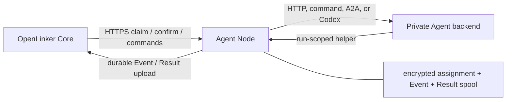

# OpenLinker Agent Node

OpenLinker Agent Node runs an Agent that lives on a workstation, inside a
private network, or behind NAT. Core assigns work over outbound HTTPS; Agent
Node invokes the local HTTP service, command, A2A Agent, or Codex workspace and
returns the resulting Events and Result.

This is the callee-side runtime, not a second control plane. Agents with a
stable HTTPS or remote MCP endpoint can be connected to Core directly and do
not need Agent Node.

Chinese documentation: [README.zh-CN.md](./README.zh-CN.md)

## Runtime v2

Agent Node has one production transport: reliable Runtime v2 over HTTP
long-polling. It requires TLS 1.3 mutual TLS and an Agent Token. There is no
transport mode switch or compatibility path for the earlier runtime protocol.

The protocol is deliberately conservative around execution:

1. The node opens a runtime session with a stable worker ID and a new session
   epoch.
2. It claims an offer, encrypts and fsyncs the assignment, records `ack_sent`,
   and sends the assignment ACK.
3. It starts the adapter only after Core confirms the lease, or after an
   authoritative resume decision says `continue_execution`.
4. Events and the terminal Result are encrypted and fsynced before upload.
   Retries keep the same Event/Result IDs; files are removed only after the
   matching typed ACK.
5. Lease renewal and command polling run alongside execution. A cancellation
   targets the exact Attempt and its process tree; `stopped` is acknowledged
   only after the adapter has exited.

A hard crash after a process has started is fail-closed: Agent Node reports the
durable state on restart but never guesses that rerunning the process is safe.
Core must revoke that Attempt and create a new Attempt when retry policy allows.



## Quick start

Prerequisites:

- Go 1.25 or newer
- an Agent and Node registered in Core
- their lowercase UUIDs and an Agent Token
- a Core-issued client certificate, private key, and trusted CA bundle
- a private, persistent data directory
- a local backend

Build and test:

```bash
go test ./...
go build ./cmd/openlinker-agent-node
```

Run a local HTTP backend:

```bash
OPENLINKER_CORE_V2_URL=https://runtime.example.com:8443 \
OPENLINKER_NODE_ID=11111111-1111-4111-8111-111111111111 \
OPENLINKER_AGENT_ID=22222222-2222-4222-8222-222222222222 \
OPENLINKER_AGENT_TOKEN=ol_agent_xxx \
OPENLINKER_AGENT_NODE_DATA_DIR=/var/lib/openlinker-agent-node \
OPENLINKER_AGENT_NODE_MTLS_CERT_FILE=/run/openlinker/node.crt \
OPENLINKER_AGENT_NODE_MTLS_KEY_FILE=/run/openlinker/node.key \
OPENLINKER_AGENT_NODE_MTLS_CA_FILE=/run/openlinker/core-ca.crt \
OPENLINKER_AGENT_NODE_ADAPTER=http \
OPENLINKER_AGENT_NODE_HTTP_URL=http://127.0.0.1:18080/run \
go run ./cmd/openlinker-agent-node
```

The data directory is single-process locked. Keep it on persistent local
storage, back it up as sensitive state, and never share one directory between
two node processes.

## Required runtime configuration

| Variable | Purpose |
| --- | --- |
| `OPENLINKER_CORE_V2_URL` | Dedicated Core Runtime mTLS origin, for example `https://runtime.example.com:8443` |
| `OPENLINKER_NODE_ID` | Registered Node UUID |
| `OPENLINKER_AGENT_ID` | Agent UUID served by this process |
| `OPENLINKER_AGENT_TOKEN` | Long-lived Agent credential kept inside the node |
| `OPENLINKER_AGENT_NODE_DATA_DIR` | Durable identity, journal, and encrypted spool |
| `OPENLINKER_AGENT_NODE_MTLS_CERT_FILE` | Client certificate |
| `OPENLINKER_AGENT_NODE_MTLS_KEY_FILE` | Client private key |
| `OPENLINKER_AGENT_NODE_MTLS_CA_FILE` | CA bundle used to verify Core |
| `OPENLINKER_AGENT_NODE_MTLS_SERVER_NAME` | Optional certificate server-name override |

Useful tuning options are `OPENLINKER_AGENT_NODE_CAPACITY`,
`OPENLINKER_AGENT_NODE_CLAIM_WAIT_SECONDS`,
`OPENLINKER_AGENT_NODE_COMMAND_WAIT_SECONDS`,
`OPENLINKER_AGENT_NODE_HEARTBEAT_SECONDS`,
`OPENLINKER_AGENT_NODE_RETRY_MIN_MS`, and
`OPENLINKER_AGENT_NODE_RETRY_MAX_MS`.

## Backend envelope

HTTP and command backends receive a run envelope. When the local helper is
enabled, its URL and run-scoped credential are included under `agent_node`:

```json
{
  "input": { "query": "..." },
  "run_id": "run uuid",
  "metadata": {},
  "agent_node": {
    "helper": {
      "base_url": "http://127.0.0.1:12345",
      "token": "run-scoped helper token",
      "endpoints": {
        "call_agent": "http://127.0.0.1:12345/a2a/call",
        "events": "http://127.0.0.1:12345/events"
      }
    }
  }
}
```

The long-lived Agent Token and assignment-scoped invocation capability are not
passed to the backend.

## Adapter modes

### `http` / `openclaw`

POST the run envelope to a local HTTP service:

```bash
OPENLINKER_AGENT_NODE_ADAPTER=openclaw
OPENLINKER_AGENT_NODE_HTTP_URL=http://127.0.0.1:18080/run
```

### `command`

Write the envelope to an operator-configured command's stdin. Cancellation
terminates the command process tree.

```bash
OPENLINKER_AGENT_NODE_ADAPTER=command
OPENLINKER_AGENT_NODE_COMMAND=/usr/local/bin/my-agent
OPENLINKER_AGENT_NODE_ARGS='["run","--json"]'
```

### `a2a`

Forward the run to an A2A JSON-RPC Agent:

```bash
OPENLINKER_AGENT_NODE_ADAPTER=a2a
OPENLINKER_AGENT_NODE_A2A_BASE_URL=http://127.0.0.1:31225/rpc
OPENLINKER_AGENT_NODE_A2A_METHOD=SendMessage
```

Set `OPENLINKER_AGENT_NODE_A2A_DIALECT=legacy` only for an upstream Agent that
still expects slash-style methods such as `message/send`.

### `codex`

Run Codex non-interactively in an isolated workspace:

```bash
OPENLINKER_AGENT_NODE_ADAPTER=codex
OPENLINKER_AGENT_NODE_CODEX_BIN=codex
OPENLINKER_AGENT_NODE_CODEX_WORKSPACE=/srv/openlinker/codex-work
OPENLINKER_AGENT_NODE_CODEX_SANDBOX=workspace-write
```

## Events and delegated Agent calls

The localhost helper is enabled by default for `http`, `openclaw`, `command`,
and `codex`. Command backends also receive:

```text
OPENLINKER_AGENT_NODE_HELPER_URL
OPENLINKER_AGENT_NODE_HELPER_TOKEN
OPENLINKER_AGENT_NODE_HELPER_CALL_AGENT_URL
OPENLINKER_AGENT_NODE_HELPER_EVENTS_URL
```

Every delegated Agent call must provide an `idempotency_key`. Reuse the same
key when retrying the same call intent; use a new key for a distinct intent,
even when its request body is identical.

```bash
curl -X POST "$OPENLINKER_AGENT_NODE_HELPER_CALL_AGENT_URL" \
  -H "Authorization: Bearer $OPENLINKER_AGENT_NODE_HELPER_TOKEN" \
  -H "Content-Type: application/json" \
  -d '{"target_agent_id":"target-agent-uuid","idempotency_key":"invoice-42-review-v1","reason":"review","input":{"invoice_id":"42"}}'
```

```bash
curl -X POST "$OPENLINKER_AGENT_NODE_HELPER_EVENTS_URL" \
  -H "Authorization: Bearer $OPENLINKER_AGENT_NODE_HELPER_TOKEN" \
  -H "Content-Type: application/json" \
  -d '{"event_type":"run.message.delta","payload":{"text":"working"}}'
```

Programmatic adapters follow the same rule: `RunContext.CallAgent` rejects a
call whose `CallAgentOptions.IdempotencyKey` is empty.

## Optional public A2A server

Agent Node can also expose its backend as an inbound A2A server. This is
independent of the Core runtime and is disabled by default:

```bash
OPENLINKER_AGENT_NODE_PUBLIC_A2A=true
OPENLINKER_AGENT_NODE_PUBLIC_A2A_HOST=127.0.0.1
OPENLINKER_AGENT_NODE_PUBLIC_A2A_PORT=19091
OPENLINKER_AGENT_NODE_PUBLIC_A2A_SLUG=my-agent
OPENLINKER_AGENT_NODE_PUBLIC_A2A_NAME="My Agent"
OPENLINKER_PUBLIC_A2A_TOKEN=optional-bearer-token
```

Push Notification Config state in this optional server is memory-backed. Use
Core's platform A2A adapter when callback subscriptions must be durable.

## Security and operations

- Treat the Agent Token, mTLS private key, spool key, assignment payloads, and
  helper tokens as secrets.
- Do not mount the runtime data directory into backend containers.
- Keep command and Codex workspaces isolated and narrowly permissioned.
- Graceful shutdown first advertises capacity zero, waits for active adapters,
  closes the runtime session, and then releases the data-directory lock.
- Redact credentials, private URLs, customer payloads, and adapter logs before
  filing an issue.

See [SECURITY.md](./SECURITY.md), [SUPPORT.md](./SUPPORT.md), and
[CONTRIBUTING.md](./CONTRIBUTING.md).

## License

Apache-2.0. See [LICENSE](./LICENSE).
