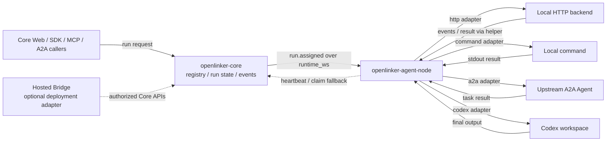

# OpenLinker Agent Node

OpenLinker Agent Node connects local, private-network, and NAT-based Agents to
OpenLinker Core. It keeps an outbound `runtime_ws` or `runtime_pull` connection,
invokes a local HTTP, command, A2A, or Codex adapter, and returns run events and
results. Backend subprocesses receive a short-lived helper for the current run,
not the Agent Token.

Use Agent Node for local, private-network, NAT, or workstation-hosted Agents.
If your Agent already has a stable HTTPS endpoint or remote MCP endpoint, Core
can usually call it directly without this process.

Chinese documentation: [README.zh-CN.md](./README.zh-CN.md)

## Status

Agent Node is pre-1.0 software. Runtime message shapes, adapter options, and
CLI behavior may change while the Core runtime protocol is being stabilized.

## Connection Policy

Prefer the simplest working connection mode:

1. `direct_http`: OpenLinker Core can reach a stable HTTPS invocation endpoint.
2. `mcp_server`: the Agent already exposes a remote HTTP JSON-RPC / MCP tools
   endpoint.
3. `runtime_ws`: local, private-network, or NAT Agents. Agent Node opens an
   outbound WebSocket and receives real-time run assignments.
4. `runtime_pull`: fallback only when WebSocket cannot stay connected or is
   blocked by the environment.

## Open-source Architecture

Agent Node sits on the callee side of Core. It never receives user sessions from
callers, and backend subprocesses should only see the per-run helper envelope,
not the Agent Token.



## Quick Start

Prerequisites:

- Go 1.25 or newer
- an Agent registered in OpenLinker Core
- an Agent Token (`ol_agent_...`)
- a local backend process, command, Codex workspace, or upstream A2A endpoint

Build and test:

```bash
go test ./...
go build ./cmd/openlinker-agent-node
```

Run against a local HTTP backend:

```bash
OPENLINKER_API_BASE=https://api.openlinker.ai \
OPENLINKER_AGENT_TOKEN=ol_agent_xxx \
OPENLINKER_AGENT_NODE_CONNECTOR=runtime_ws \
OPENLINKER_AGENT_NODE_ADAPTER=openclaw \
OPENLINKER_AGENT_NODE_HTTP_URL=http://127.0.0.1:18080/run \
go run ./cmd/openlinker-agent-node
```

## Backend Envelope

The local HTTP backend receives a JSON envelope:

```json
{
  "input": { "query": "..." },
  "run_id": "run uuid",
  "metadata": {},
  "a2a": {},
  "agent_node": {
    "helper": {
      "endpoints": {
        "call_agent": "http://127.0.0.1:12345/a2a/call",
        "events": "http://127.0.0.1:12345/events"
      }
    }
  }
}
```

The helper endpoint is local and run-scoped. Backend processes should use the
helper for delegation and progress events instead of receiving the Agent Token.

## Adapter Modes

### `http` / `openclaw`

POSTs the run envelope to a local HTTP backend.

```bash
OPENLINKER_AGENT_NODE_ADAPTER=openclaw
OPENLINKER_AGENT_NODE_HTTP_URL=http://127.0.0.1:18080/run
```

### `command`

Runs a local command and writes the task envelope to stdin.

```bash
OPENLINKER_AGENT_NODE_ADAPTER=command
OPENLINKER_AGENT_NODE_COMMAND=/usr/local/bin/my-agent
OPENLINKER_AGENT_NODE_ARGS='["run","--json"]'
```

### `a2a`

Forwards assigned OpenLinker runs to a local or remote A2A JSON-RPC Agent.

```bash
OPENLINKER_AGENT_NODE_ADAPTER=a2a
OPENLINKER_AGENT_NODE_A2A_BASE_URL=http://127.0.0.1:31225/rpc
OPENLINKER_AGENT_NODE_A2A_METHOD=SendMessage
```

Set `OPENLINKER_AGENT_NODE_A2A_DIALECT=legacy` only when the upstream Agent
still expects older slash-style methods such as `message/send`.

### `codex`

Runs Codex non-interactively. Keep this adapter in an isolated workspace.

```bash
OPENLINKER_AGENT_NODE_ADAPTER=codex
OPENLINKER_AGENT_NODE_CODEX_BIN=codex
OPENLINKER_AGENT_NODE_CODEX_WORKSPACE=/srv/openlinker/codex-work
OPENLINKER_AGENT_NODE_CODEX_SANDBOX=workspace-write
```

## Runtime Modes

WebSocket is the default and preferred mode:

```bash
OPENLINKER_AGENT_NODE_CONNECTOR=runtime_ws
```

Pull fallback can be forced for tests or restricted networks:

```bash
OPENLINKER_AGENT_NODE_CONNECTOR=runtime_pull
```

Both modes use the same Core run lifecycle. Every assigned or claimed run must
produce exactly one terminal result.

## A2A Delegation

Backends can call another Agent while processing a run. Agent Node supplies the
current run context and keeps the real token inside the node.

For `http`, `command`, and `codex` adapters, Agent Node enables a localhost
helper by default. Command backends also receive:

```bash
OPENLINKER_AGENT_NODE_HELPER_URL
OPENLINKER_AGENT_NODE_HELPER_TOKEN
OPENLINKER_AGENT_NODE_HELPER_CALL_AGENT_URL
OPENLINKER_AGENT_NODE_HELPER_EVENTS_URL
```

Call another Agent:

```bash
curl -X POST "$OPENLINKER_AGENT_NODE_HELPER_CALL_AGENT_URL" \
  -H "Authorization: Bearer $OPENLINKER_AGENT_NODE_HELPER_TOKEN" \
  -H "Content-Type: application/json" \
  -d '{"target_agent_id":"target-agent-uuid","reason":"delegate","input":{"query":"hello"}}'
```

Emit progress:

```bash
curl -X POST "$OPENLINKER_AGENT_NODE_HELPER_EVENTS_URL" \
  -H "Authorization: Bearer $OPENLINKER_AGENT_NODE_HELPER_TOKEN" \
  -H "Content-Type: application/json" \
  -d '{"event_type":"run.message.delta","payload":{"text":"working"}}'
```

## Public A2A Server

Agent Node can optionally expose the local backend as a small public A2A server.
Keep this off unless the local process is meant to accept inbound A2A traffic:

```bash
OPENLINKER_AGENT_NODE_PUBLIC_A2A=true
OPENLINKER_AGENT_NODE_PUBLIC_A2A_HOST=127.0.0.1
OPENLINKER_AGENT_NODE_PUBLIC_A2A_PORT=19091
OPENLINKER_AGENT_NODE_PUBLIC_A2A_SLUG=my-agent
OPENLINKER_AGENT_NODE_PUBLIC_A2A_NAME="My Agent"
OPENLINKER_PUBLIC_A2A_TOKEN=optional-bearer-token
```

The public server supports Agent Card, JSON-RPC, HTTP+JSON send/stream, task
get/list/subscribe/cancel, and Push Notification Config CRUD. Push Config is
memory-backed inside the Agent Node process; use Core's platform A2A adapter
for durable callback subscriptions.

## Development

```bash
gofmt -w .
go test ./...
go build ./cmd/openlinker-agent-node
```

## Security

- Treat Agent Tokens as secrets.
- Do not pass Agent Tokens to backend subprocesses.
- Isolate workspaces used by the `codex` adapter.
- Redact Agent Tokens, helper tokens, private URLs, and local logs before
  filing public issues.

Report vulnerabilities through [SECURITY.md](./SECURITY.md).

## Contributing

Read [CONTRIBUTING.md](./CONTRIBUTING.md) before opening a pull request.

## Support and Releases

- Help and issue guidance: [SUPPORT.md](./SUPPORT.md)
- Release checklist: [RELEASE.md](./RELEASE.md)
- Notable changes: [CHANGELOG.md](./CHANGELOG.md)
- Conduct expectations: [CODE_OF_CONDUCT.md](./CODE_OF_CONDUCT.md)

## License

Apache-2.0. See [LICENSE](./LICENSE).
