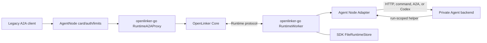

# OpenLinker Agent Node

Chinese documentation: [README.zh-CN.md](./README.zh-CN.md)

Agent Node connects an Agent you already have to OpenLinker. It runs next to the
existing backend, receives a task from OpenLinker Runtime, starts or calls the
backend, and returns the answer.

It can adapt:

- a local HTTP service;
- an operator-chosen command;
- an A2A JSON-RPC Agent;
- a non-interactive Codex process.

Agent Node is mainly a migration adapter. If a new Go, TypeScript, or Python
Agent can use an OpenLinker SDK Runtime Worker directly, it does not need Agent
Node. A stable public HTTPS Agent or remote MCP server also does not need it.

## How it works

1. The `openlinker-go` Runtime Worker receives and safely records a task.
2. Agent Node passes the task to the selected local backend.
3. The backend returns its answer; Agent Node sends it back through the SDK.
4. If OpenLinker cancels the task, command and Codex adapters stop their process
   trees.

The long-lived Agent Token stays inside Agent Node. A backend that needs to call
another Agent receives a short-lived localhost helper for the current task
instead.

## Technical boundary

Agent Node does not implement a Runtime client or state machine. The pinned Go
SDK owns discovery, mTLS, Session identity, WebSocket/Pull switching,
assignment confirmation, lease renewal, resume, cancellation, drain, the
encrypted journal, and stable Event/Result replay. The same SDK behavior is
available directly to any Go application through `NewRuntimeWorker`.

This repository owns environment and CLI parsing, Adapter selection,
localhost helper sessions, process-tree control, the public A2A compatibility
listener shell (cards, authentication, and request limits), and the choice of
SDK file-store directory. The SDK proxies that listener's A2A operations to
Core, except for stateless Agent Card responses whose external URL must remain
the AgentNode listener. Cancellation reaches an Adapter through the SDK handler
context; command and Codex Adapters terminate their own process trees before
returning.

Agent Node connects only to the Core Runtime contract. It does not call Hosted
service-listing, order, wallet, billing, or marketplace-operation APIs, and it
does not provide an MCP Adapter.



## Status and installation

Agent Node is pre-1.0 and intended as a migration path for existing backends,
not as the default way to build a new Agent. Pin the Core, Go SDK, and Agent
Node versions together and review `CHANGELOG.md` before upgrading.

Prebuilt binaries for Linux, macOS, and Windows, together with adjacent
`.sha256` files, are available from
[GitHub Releases](https://github.com/OpenLinker-ai/openlinker-agent-node/releases).
Verify the checksum before installing a binary. Contributors can build from
source with the commands below.

## Quick start

Prerequisites:

- Go 1.25 or newer
- an active Agent Token
- a private, persistent data directory
- a local backend

Build and test:

```bash
go test ./...
go build ./cmd/openlinker-agent-node
```

On first start the SDK creates the Node ID and P-256 private key inside the
private data directory, binds that public key one-to-one to the Agent Token,
and obtains a 24-hour client certificate. Renewal is automatic.

Run a local HTTP backend:

```bash
OPENLINKER_URL=https://openlinker.example \
OPENLINKER_AGENT_TOKEN=ol_agent_xxx \
OPENLINKER_AGENT_NODE_DATA_DIR=/var/lib/openlinker-agent-node \
OPENLINKER_AGENT_NODE_TRANSPORT=auto \
OPENLINKER_AGENT_NODE_ADAPTER=http \
OPENLINKER_AGENT_NODE_HTTP_URL=http://127.0.0.1:18080/run \
go run ./cmd/openlinker-agent-node
```

The SDK `FileRuntimeStore` takes a single-process lock on the data directory.
Keep it on persistent local storage, back it up as sensitive state, and never
share one directory between two node processes.

The SDK's encrypted spool is bounded to 512 MiB and 10,000 records. At 80% usage the
worker advertises capacity zero and stops accepting new Runs while it continues
renewal, cancellation, upload, and cleanup for existing Attempts. Data writes
cannot consume the final 16 MiB of logical or filesystem capacity, leaving
space for journal/control progress. Corruption, authentication failure, a
missing key, or exhausted capacity fails closed; unacknowledged Results are
never expired or deleted.

## Required Agent Node configuration

At startup, the Go SDK Worker reads the public connection manifest from
`$OPENLINKER_URL/.well-known/openlinker.json` and discovers the dedicated
Runtime origin. Discovery uses a separate five-second HTTP client, follows no
redirects, reads at most 64 KiB, and sends neither the Agent Token nor the mTLS
client certificate. A missing, disabled, insecure, or malformed Runtime entry
stops startup instead of falling back to the ordinary API origin.

| Variable | Purpose |
| --- | --- |
| `OPENLINKER_URL` | OpenLinker platform origin used to discover the Runtime connection |
| `OPENLINKER_NODE_ID` | Optional legacy Node UUID override; generated automatically by default |
| `OPENLINKER_AGENT_ID` | Optional legacy Agent UUID override; resolved from the Agent Token by default |
| `OPENLINKER_AGENT_TOKEN` | Long-lived Agent Token kept inside the node |
| `OPENLINKER_AGENT_NODE_DATA_DIR` | Directory selected for the SDK `FileRuntimeStore` |
| `OPENLINKER_AGENT_NODE_MTLS_CERT_FILE` | Optional external-PKI compatibility certificate |
| `OPENLINKER_AGENT_NODE_MTLS_KEY_FILE` | Optional external-PKI compatibility private key |
| `OPENLINKER_AGENT_NODE_MTLS_CA_FILE` | Optional external-PKI compatibility CA bundle |
| `OPENLINKER_AGENT_NODE_MTLS_SERVER_NAME` | Optional certificate server-name override |
| `OPENLINKER_AGENT_NODE_TRANSPORT` | `auto` (default), `ws`, or `pull`; all share one Runtime session |

`OPENLINKER_RUNTIME_URL` is an advanced override for integration tests and
private-network routing. It must be an absolute HTTPS origin and skips public
discovery. Normal deployments should leave it unset.

Useful tuning options are `OPENLINKER_AGENT_NODE_CAPACITY`,
`OPENLINKER_AGENT_NODE_CLAIM_WAIT_SECONDS`,
`OPENLINKER_AGENT_NODE_COMMAND_WAIT_SECONDS`,
`OPENLINKER_AGENT_NODE_HEARTBEAT_SECONDS`,
`OPENLINKER_AGENT_NODE_RETRY_MIN_MS`, and
`OPENLINKER_AGENT_NODE_RETRY_MAX_MS`.

Use `auto` for normal deployments. Use `ws` when operators prefer the node to
wait for WebSocket recovery instead of serving through long-poll. Use `pull` only
for networks where WebSocket is known to be unavailable. Transport changes are
implemented by the SDK and reuse the current session identity, journal,
encrypted spool, leases, and per-Run cancellation state.

## Backend envelope

HTTP and command backends receive a run envelope. When the local helper is
enabled, its URL and run-scoped credential are included under `agent_node`:

```json
{
  "input": { "query": "..." },
  "run_id": "run uuid",
  "metadata": {},
  "agent_node": {
    "helper": {
      "base_url": "http://127.0.0.1:12345",
      "token": "run-scoped helper token",
      "endpoints": {
        "call_agent": "http://127.0.0.1:12345/a2a/call",
        "events": "http://127.0.0.1:12345/events"
      }
    }
  }
}
```

The long-lived Agent Token and assignment-scoped invocation capability are not
passed to the backend.

## Adapter modes

### `http` / `openclaw`

POST the run envelope to a local HTTP service:

```bash
OPENLINKER_AGENT_NODE_ADAPTER=openclaw
OPENLINKER_AGENT_NODE_HTTP_URL=http://127.0.0.1:18080/run
```

### `command`

Write the envelope to an operator-configured command's stdin. Cancellation
terminates the command process tree.

```bash
OPENLINKER_AGENT_NODE_ADAPTER=command
OPENLINKER_AGENT_NODE_COMMAND=/usr/local/bin/my-agent
OPENLINKER_AGENT_NODE_ARGS='["run","--json"]'
```

### `a2a`

Forward the run to an A2A JSON-RPC Agent:

```bash
OPENLINKER_AGENT_NODE_ADAPTER=a2a
OPENLINKER_AGENT_NODE_A2A_BASE_URL=http://127.0.0.1:31225/rpc
OPENLINKER_AGENT_NODE_A2A_METHOD=SendMessage
```

Set `OPENLINKER_AGENT_NODE_A2A_DIALECT=legacy` only for an upstream Agent that
still expects slash-style methods such as `message/send`.

### `codex`

Run Codex non-interactively in an isolated workspace:

```bash
OPENLINKER_AGENT_NODE_ADAPTER=codex
OPENLINKER_AGENT_NODE_CODEX_BIN=codex
OPENLINKER_AGENT_NODE_CODEX_WORKSPACE=/srv/openlinker/codex-work
OPENLINKER_AGENT_NODE_CODEX_SANDBOX=workspace-write
```

## Events and delegated Agent calls

The localhost helper is enabled by default for `http`, `openclaw`, `command`,
and `codex`. Command backends also receive:

```text
OPENLINKER_AGENT_NODE_HELPER_URL
OPENLINKER_AGENT_NODE_HELPER_TOKEN
OPENLINKER_AGENT_NODE_HELPER_CALL_AGENT_URL
OPENLINKER_AGENT_NODE_HELPER_EVENTS_URL
```

Every delegated Agent call must provide an `idempotency_key`. Reuse the same
key when retrying the same call intent; use a new key for a distinct intent,
even when its request body is identical.

```bash
curl -X POST "$OPENLINKER_AGENT_NODE_HELPER_CALL_AGENT_URL" \
  -H "Authorization: Bearer $OPENLINKER_AGENT_NODE_HELPER_TOKEN" \
  -H "Content-Type: application/json" \
  -d '{"target_agent_id":"target-agent-uuid","idempotency_key":"invoice-42-review-v1","reason":"review","input":{"invoice_id":"42"}}'
```

```bash
curl -X POST "$OPENLINKER_AGENT_NODE_HELPER_EVENTS_URL" \
  -H "Authorization: Bearer $OPENLINKER_AGENT_NODE_HELPER_TOKEN" \
  -H "Content-Type: application/json" \
  -d '{"event_type":"run.message.delta","payload":{"text":"working"}}'
```

Programmatic adapters follow the same rule: `RunContext.CallAgent` rejects a
call whose `CallAgentOptions.IdempotencyKey` is empty.

## Optional public A2A compatibility listener

Agent Node can expose a local inbound A2A URL for compatibility. The listener
serves the local Agent Card and validates `OPENLINKER_PUBLIC_A2A_TOKEN`; the Go
SDK forwards every message, task, push-notification, stateful JSON-RPC, and SSE
request to Core over the configured Agent Token and mTLS identity. REST and
JSON-RPC Agent Card responses remain local so their external URL continues to
name this listener. Core remains the sole authority for A2A task, run, stream,
and push state. The listener is disabled by default:

```bash
OPENLINKER_AGENT_NODE_PUBLIC_A2A=true
OPENLINKER_AGENT_NODE_PUBLIC_A2A_HOST=127.0.0.1
OPENLINKER_AGENT_NODE_PUBLIC_A2A_PORT=19091
OPENLINKER_AGENT_NODE_PUBLIC_A2A_SLUG=my-agent
OPENLINKER_AGENT_NODE_PUBLIC_A2A_NAME="My Agent"
OPENLINKER_PUBLIC_A2A_TOKEN=optional-bearer-token
```

The compatibility listener caps each request body at 1 MiB and applies bounded
header/body read timeouts. SSE responses have no listener-wide write deadline;
their lifetime follows client cancellation and the Core stream.

## Security and operations

- Treat the Agent Token, mTLS private key, SDK-managed spool key, assignment
  payloads, and helper tokens as secrets.
- Do not mount the runtime data directory into backend containers.
- Keep command and Codex workspaces isolated and narrowly permissioned.
- Graceful shutdown first advertises capacity zero, waits for active adapters,
  closes the runtime session, and then releases the data-directory lock.
- Redact credentials, private URLs, customer payloads, and adapter logs before
  filing an issue.
- Alert before the SDK spool reaches 80%. Free space or complete existing uploads;
  never delete `.record`, journal, identity, or key files by hand.

See [SECURITY.md](./SECURITY.md), [SUPPORT.md](./SUPPORT.md), and
[CONTRIBUTING.md](./CONTRIBUTING.md).

## License

Apache-2.0. See [LICENSE](./LICENSE).
