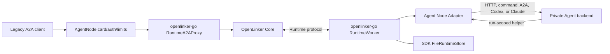

# OpenLinker Agent Node

Chinese documentation: [README.zh-CN.md](./README.zh-CN.md)

Agent Node connects an Agent you already have to OpenLinker. It runs next to the
existing backend, receives a task from OpenLinker Runtime, starts or calls the
backend, and returns the answer.

It can adapt:

- a local HTTP service;
- an operator-chosen command;
- an A2A JSON-RPC Agent;
- a non-interactive Codex or Claude Code process, through this repository's native adapters.

Agent Node is a deployable bridge for existing backends, not a mandatory intermediary. If a new Go, TypeScript, or Python
Agent can use an OpenLinker SDK Runtime Worker directly, it does not need Agent
Node. A stable public HTTPS Agent or remote MCP server also does not need it.

## How it works

1. The `openlinker-go` Runtime Worker receives and safely records a task.
2. Agent Node passes the task to the selected local backend.
3. The backend returns its answer; Agent Node sends it back through the SDK.
4. If OpenLinker cancels the task, command and native provider adapters stop their process
   trees.

The long-lived Agent Token stays inside Agent Node. A backend that needs to call
another Agent receives a short-lived localhost helper (HTTP/command) or
Attempt-scoped MCP delegation tools (native Codex/Claude) instead.

## Technical boundary

Agent Node does not implement a Runtime client or state machine. The pinned Go
SDK owns discovery and the token-only or mTLS security policy, Session identity, WebSocket/Pull switching,
assignment confirmation, lease renewal, resume, cancellation, drain, the
encrypted journal, and stable Event/Result replay. The same SDK behavior is
available directly to any Go application through `NewRuntimeWorker`.

This repository owns environment and CLI parsing, Adapter selection,
localhost helper sessions, process-tree control, the public A2A compatibility
listener shell (cards, authentication, and request limits), and the choice of
SDK file-store directory. The SDK proxies that listener's A2A operations to
Core, except for stateless Agent Card responses whose external URL must remain
the AgentNode listener. Cancellation reaches an Adapter through the SDK handler
context; command and native provider Adapters terminate their own process trees before
returning.

The public `pkg/adapters` packages also provide protocol leaves that CLI and
Plugin can reuse at compile time; that does not require running a Node process.
Neither the Node module nor its package graph depends on CLI or Plugin. Plugin
keeps its independent deep execution policy and Browser/Viewer/Profile products.

Agent Node connects only to the Core Runtime contract. It does not call Hosted
service-listing, order, wallet, billing, or marketplace-operation APIs, and it
does not provide an MCP Adapter.


```mermaid
flowchart LR
  Core["OpenLinker Core"] <-->|"Runtime protocol"| SDK["openlinker-go RuntimeWorker"]
  SDK --> Handler["Agent Node Adapter"]
  Handler -->|"HTTP, command, A2A, Codex, or Claude"| Backend["Private Agent backend"]
  Backend -->|"run-scoped helper"| Handler
  SDK --- Store["SDK FileRuntimeStore"]
  A2AClient["Legacy A2A client"] --> Compat["AgentNode card/auth/limits"]
  Compat --> Proxy["openlinker-go RuntimeA2AProxy"]
  Proxy --> Core
```

## Status and installation

Agent Node is pre-1.0 and intended as a bridge for existing backends,
not as the default way to build a new Agent. Pin the Core, Go SDK, and Agent
Node versions together and review `CHANGELOG.md` before upgrading.

Prebuilt binaries for Linux, macOS, and Windows, together with adjacent
`.sha256` files, are available from
[GitHub Releases](https://github.com/OpenLinker-ai/openlinker-agent-node/releases).
Verify the checksum before installing a binary. Contributors can build from
source with the commands below.

### Candidate build identity and test-only enrollment

This source candidate adds `openlinker-agent-node --version`. It returns the
same implementation identity used for Runtime enrollment before reading
configuration, starting a Provider/listener, opening SDK state, or making a
network request. No arguments starts the configured Worker; unsupported
arguments fail without startup. Older published binaries do not have this flag.

Source builds report `openlinker-agent-node/dev`; packaged builds inject the
exact `v...` tag or `sha-...` identity. The release builder is
`node scripts/build-agent-node.mjs <version> <output>` (Node.js 22 and Go are
build tools, not requirements for running a downloaded binary).

**This candidate is eligible only for pre-1.0 test prereleases, not an in-place
upgrade of an enrolled Node.** The release gate accepts only canonical
`v0.x.y-alpha.N`, `v0.x.y-beta.N`, or `v0.x.y-rc.N` tags. Numeric components are
nonnegative with no leading zeroes. Stable tags, v1+ tags, and missing or malformed
arguments are rejected; there is no environment bypass. Non-tag SHA artifacts
remain available for CI testing but are not GitHub releases.

For a test deployment with no real users, the supported change-of-version path
is explicit fresh enrollment:

1. Stop new test calls, confirm all old Attempts have settled and the SDK spool
   is empty, then stop the old test process. Retain its private data directory;
   do not erase state or run two Workers on one directory.
2. Obtain a new, unbound, active Agent credential through the existing Core
   registration/token flow. Use a new `OPENLINKER_NODE_ID` and a new private
   `OPENLINKER_AGENT_NODE_DATA_DIR`; do not reuse the old binding, identity,
   certificates, or keys. Discovery still selects token-only or mTLS enrollment.
3. Start the exact selected binary, verify its `--version` and new Core readiness,
   then verify a test task. A changed Node identity is intentional; this is not
   an upgrade of the old enrollment or an automatic rollback mechanism.

An ordinary restart of an **active** Node retains the exact binary version,
Node identity, credential and SDK DataDir. The SDK rotates the Runtime Session;
do not create a fresh directory on each restart. This does not cover a revoked
or administratively drained Node. Changing the version under the original
enrollment is unsupported and can fail with `ContractMismatch`; never spoof
the old version to avoid it. No Core-controlled upgrade extension or generic
migration controller is required for fresh test enrollment.

These are source-level compatibility and release-policy boundaries, not proof
that this candidate has been published or deployed. Record real WebSocket and
pull enrollment, task execution and same-DataDir restart results before declaring
a target environment verified. See [RELEASE.md](./RELEASE.md).

## Quick start

Prerequisites:

- Go 1.26.4 or newer
- an active Agent Token
- a private, persistent data directory
- a local backend

Build and test:

```bash
go test ./...
go build ./cmd/openlinker-agent-node
```

Platform discovery decides whether the Runtime is token-only or requires mTLS.
For mTLS, the SDK can create the private key inside the data directory and
automatically enroll and renew a short-lived client certificate.

Run a local HTTP backend:

```bash
OPENLINKER_URL=https://openlinker.example \
OPENLINKER_AGENT_ID=22222222-2222-4222-8222-222222222222 \
OPENLINKER_AGENT_TOKEN=ol_agent_xxx \
OPENLINKER_AGENT_NODE_DATA_DIR=/var/lib/openlinker-agent-node \
OPENLINKER_AGENT_NODE_TRANSPORT=auto \
OPENLINKER_AGENT_NODE_ADAPTER=http \
OPENLINKER_AGENT_NODE_HTTP_URL=http://127.0.0.1:18080/run \
go run ./cmd/openlinker-agent-node
```

The SDK `FileRuntimeStore` takes a single-process lock on the data directory.
Keep it on persistent local storage, back it up as sensitive state, and never
share one directory between two node processes.

The SDK's encrypted spool is bounded to 512 MiB and 10,000 records. At 80% usage the
worker advertises capacity zero and stops accepting new Runs while it continues
renewal, cancellation, upload, and cleanup for existing Attempts. Data writes
cannot consume the final 16 MiB of logical or filesystem capacity, leaving
space for journal/control progress. Corruption, authentication failure, a
missing key, or exhausted capacity fails closed; unacknowledged Results are
never expired or deleted.

## Required Agent Node configuration

At startup, the Go SDK Worker reads the public connection manifest from
`$OPENLINKER_URL/.well-known/openlinker.json` and discovers the dedicated
Runtime origin. Discovery uses a separate five-second HTTP client, follows no
redirects, reads at most 64 KiB, and sends neither the Agent Token nor a client
certificate. The same manifest selects token-only or mTLS security. A missing, disabled, insecure, or malformed Runtime entry
stops startup instead of falling back to the ordinary API origin.

| Variable | Purpose |
| --- | --- |
| `OPENLINKER_URL` | OpenLinker platform origin used to discover the Runtime connection |
| `OPENLINKER_NODE_ID` | Optional existing Runtime Node UUID; token-only discovery derives a stable token-scoped value when omitted |
| `OPENLINKER_AGENT_ID` | Agent UUID; required for token-only Runtime |
| `OPENLINKER_AGENT_TOKEN` | Long-lived Agent Token kept inside the node |
| `OPENLINKER_AGENT_NODE_DATA_DIR` | Directory selected for the SDK `FileRuntimeStore` |
| `OPENLINKER_AGENT_NODE_MTLS_CERT_FILE` | Optional external-PKI certificate used only when discovery requires mTLS |
| `OPENLINKER_AGENT_NODE_MTLS_KEY_FILE` | Optional external-PKI private key; configure the complete cert/key/CA group |
| `OPENLINKER_AGENT_NODE_MTLS_CA_FILE` | Optional external-PKI CA bundle |
| `OPENLINKER_AGENT_NODE_MTLS_SERVER_NAME` | Optional certificate server-name override |
| `OPENLINKER_AGENT_NODE_TRANSPORT` | `auto` (default), `ws`, or `pull`; all share one Runtime session |

`OPENLINKER_RUNTIME_URL` is an advanced connection-address override for tests
and private routing. Platform discovery still runs and remains authoritative
for the security policy; an override cannot downgrade an mTLS manifest. Normal
deployments should leave it unset. A Runtime URL without `OPENLINKER_URL` uses
the legacy direct mode and requires a complete mTLS configuration.

Useful tuning options are `OPENLINKER_AGENT_NODE_CAPACITY`,
`OPENLINKER_AGENT_NODE_CLAIM_WAIT_SECONDS`,
`OPENLINKER_AGENT_NODE_COMMAND_WAIT_SECONDS`,
`OPENLINKER_AGENT_NODE_HEARTBEAT_SECONDS`,
`OPENLINKER_AGENT_NODE_RETRY_MIN_MS`, and
`OPENLINKER_AGENT_NODE_RETRY_MAX_MS`.

Use `auto` for normal deployments. Use `ws` when operators prefer the node to
wait for WebSocket recovery instead of serving through long-poll. Use `pull` only
for networks where WebSocket is known to be unavailable. Transport changes are
implemented by the SDK and reuse the current session identity, journal,
encrypted spool, leases, and per-Run cancellation state.

## Backend envelope

HTTP and command backends receive a run envelope. When the local helper is
enabled, its URL and run-scoped credential are included under `agent_node`:

```json
{
  "input": { "query": "..." },
  "run_id": "run uuid",
  "metadata": {},
  "agent_node": {
    "helper": {
      "base_url": "http://127.0.0.1:12345",
      "token": "run-scoped helper token",
      "endpoints": {
        "call_agent": "http://127.0.0.1:12345/a2a/call",
        "events": "http://127.0.0.1:12345/events"
      }
    }
  }
}
```

The long-lived Agent Token and assignment-scoped invocation capability are not
passed to the backend.

## Adapter modes

### `http` / `openclaw`

POST the run envelope to a local HTTP service:

```bash
OPENLINKER_AGENT_NODE_ADAPTER=openclaw
OPENLINKER_AGENT_NODE_HTTP_URL=http://127.0.0.1:18080/run
```

### `command`

Write the envelope to an operator-configured command's stdin. Cancellation
terminates the command process tree.

```bash
OPENLINKER_AGENT_NODE_ADAPTER=command
OPENLINKER_AGENT_NODE_COMMAND=/usr/local/bin/my-agent
OPENLINKER_AGENT_NODE_ARGS='["run","--json"]'
```

### `a2a`

Forward the run to an A2A JSON-RPC Agent:

```bash
OPENLINKER_AGENT_NODE_ADAPTER=a2a
OPENLINKER_AGENT_NODE_A2A_BASE_URL=http://127.0.0.1:31225/rpc
OPENLINKER_AGENT_NODE_A2A_METHOD=SendMessage
```

Set `OPENLINKER_AGENT_NODE_A2A_DIALECT=legacy` only for an upstream Agent that
still expects slash-style methods such as `message/send`.

### `codex`

Run Codex non-interactively in an isolated workspace:

```bash
OPENLINKER_AGENT_NODE_ADAPTER=codex
OPENLINKER_AGENT_NODE_CODEX_BIN=codex
OPENLINKER_AGENT_NODE_CODEX_WORKSPACE=/srv/openlinker/codex-work
OPENLINKER_AGENT_NODE_CODEX_SANDBOX=workspace-write
```

### `claude`

```bash
OPENLINKER_AGENT_NODE_ADAPTER=claude
OPENLINKER_AGENT_NODE_CLAUDE_BIN=claude
OPENLINKER_AGENT_NODE_CLAUDE_WORKSPACE=/srv/openlinker/claude-work
OPENLINKER_AGENT_NODE_CLAUDE_PERMISSION=dontAsk
OPENLINKER_AGENT_NODE_CLAUDE_WEB_SEARCH=false
```

`OPENLINKER_AGENT_NODE_CLAUDE_WEB_SEARCH` defaults to **false**: the bridge
passes `--disallowedTools WebSearch,WebFetch`. Explicit `true` removes that
bridge-level deny for both built-in tools. It does not change `dontAsk`,
`--safe-mode`, the allowed-tools list, managed policy, Browser or delegation.
Tool availability is not automatic approval or a guarantee of network access;
review any required `OPENLINKER_AGENT_NODE_CLAUDE_ALLOWED_TOOLS` entries separately. This is not an
OS sandbox or a general network-deny switch.

Values are case-insensitive and whitespace-trimmed: true/false, 1/0, yes/no,
on/off; empty is false. Other values fail configuration before startup without
echoing the value. Configuration is fixed for the Node lifetime, not hot-reloaded.
The `v0.1.57-rc.1` binary did not read this setting; setting an environment
variable cannot repair that binary. Use a release containing this fix and follow
the fresh-enrollment version-change procedure above; do not relabel it as rc.1.

Both native adapters use this repository's `pkg/adapters`; shared protocol
parsing, private session storage and process mechanisms live in its public
leaf packages. The pinned SDK is
`v0.2.0-rc8.0.20260908135527-31afbf9c1a18`. Startup checks the installed
CLI version and required flags (tested baselines: Codex 0.153.0, Claude 2.1.259).
Codex uses bounded JSONL final messages; Claude streams normalized progress.
`CODEX_SESSION_REUSE` / `CLAUDE_SESSION_REUSE` and `*_SESSION_STORE` with the
`OPENLINKER_AGENT_NODE_` prefix configure native session reuse. Core history
is synchronized on resume. Legacy Node Codex maps are not imported: a new
session is seeded from Core history. The old plaintext session-key output and
model-visible localhost helper credentials have been removed.

Native session reuse defaults to **false**. Enable it explicitly when preserving
an existing workflow; that configuration is not evidence of the default
behavior. Workspace and session-store paths must remain stable for reuse.
Separate directories alone do not isolate processes running under the same OS
identity from local files or other sessions.

Successful Claude results provide two optional, long-lived diagnostics:

- `claude_resume_session_id_sha256`: SHA256 of the exact ID passed to `--resume`
  in the successful invocation; omitted when that invocation did not resume.
- `claude_session_id_sha256`: SHA256 of the exact nonempty `result.session_id`
  returned by Claude; omitted when unavailable, never backfilled from a request.

They are lowercase hexadecimal SHA256 values of the UTF-8 IDs, not credentials
or authorization inputs. Missing-session recovery clears evidence from the
failed invocation; a successful fresh retry does not claim a successful resume.
Missing fields do not prove matching sessions. These hashes remain correlatable
Run diagnostics and follow result access/retention policy; raw session IDs are
not added to the result. The existing `claude_session_reuse` field is emitted
only when reuse is enabled and a trusted session key is available.

To enable native delegation, set `OPENLINKER_AGENT_NODE_DELEGATION_TARGETS` to a
JSON array of allowed Agent UUIDs and `OPENLINKER_AGENT_NODE_DELEGATION_PROXY_BIN`
to a compatible OpenLinker CLI. The host must pass `plugin capabilities`.
`OPENLINKER_AGENT_NODE_DELEGATION_BROKER_ROOT` optionally selects a private
socket directory. Delegation is disabled by default and requires the SDK/Core
`delegated_run_read.v1` extension. `CLAUDE_ALLOWED_TOOLS` with the same Node
prefix takes a JSON string array; `OPENLINKER_AGENT_NODE_TIMEOUT_MS` applies to
both providers. Native providers receive scoped MCP tools, not helper tokens.

## Events and delegated Agent calls

The localhost helper is enabled by default for `http`, `openclaw`, and `command`. Command backends also receive:

```text
OPENLINKER_AGENT_NODE_HELPER_URL
OPENLINKER_AGENT_NODE_HELPER_TOKEN
OPENLINKER_AGENT_NODE_HELPER_CALL_AGENT_URL
OPENLINKER_AGENT_NODE_HELPER_EVENTS_URL
```

Every delegated Agent call must provide an `idempotency_key`. Reuse the same
key when retrying the same call intent; use a new key for a distinct intent,
even when its request body is identical.

```bash
curl -X POST "$OPENLINKER_AGENT_NODE_HELPER_CALL_AGENT_URL" \
  -H "Authorization: Bearer $OPENLINKER_AGENT_NODE_HELPER_TOKEN" \
  -H "Content-Type: application/json" \
  -d '{"target_agent_id":"target-agent-uuid","idempotency_key":"invoice-42-review-v1","reason":"review","input":{"invoice_id":"42"}}'
```

```bash
curl -X POST "$OPENLINKER_AGENT_NODE_HELPER_EVENTS_URL" \
  -H "Authorization: Bearer $OPENLINKER_AGENT_NODE_HELPER_TOKEN" \
  -H "Content-Type: application/json" \
  -d '{"event_type":"run.message.delta","payload":{"text":"working"}}'
```

Programmatic adapters follow the same rule: `RunContext.CallAgent` rejects a
call whose `CallAgentOptions.IdempotencyKey` is empty.

## Optional public A2A compatibility listener

Agent Node can expose a local inbound A2A URL for compatibility. The listener
serves the local Agent Card and validates `OPENLINKER_PUBLIC_A2A_TOKEN`; the Go
SDK forwards every message, task, push-notification, stateful JSON-RPC, and SSE
request to Core over the configured Agent Token and discovered security policy. REST and
JSON-RPC Agent Card responses remain local so their external URL continues to
name this listener. Core remains the sole authority for A2A task, run, stream,
and push state. The listener is disabled by default:

```bash
OPENLINKER_AGENT_NODE_PUBLIC_A2A=true
OPENLINKER_AGENT_NODE_PUBLIC_A2A_HOST=127.0.0.1
OPENLINKER_AGENT_NODE_PUBLIC_A2A_PORT=19091
OPENLINKER_AGENT_NODE_PUBLIC_A2A_SLUG=my-agent
OPENLINKER_AGENT_NODE_PUBLIC_A2A_NAME="My Agent"
OPENLINKER_PUBLIC_A2A_TOKEN=optional-bearer-token
```

The compatibility listener caps each request body at 1 MiB and applies bounded
header/body read timeouts. SSE responses have no listener-wide write deadline;
their lifetime follows client cancellation and the Core stream.

## Security and operations

- Treat the Agent Token, any mTLS private key, SDK-managed spool key, assignment
  payloads, and helper tokens as secrets.
- Do not mount the runtime data directory into backend containers.
- Keep command and native provider workspaces isolated and narrowly permissioned.
- Stop is not a substitute for a confirmed drain. Fence admissions and verify
  Core settlement and empty SDK spool before an operational switch; stopping a
  process can cancel active adapters. Preserve state when shutdown cannot finish.
- Redact credentials, private URLs, customer payloads, and adapter logs before
  filing an issue.
- Alert before the SDK spool reaches 80%. Free space or complete existing uploads;
  never delete `.record`, journal, identity, or key files by hand.

See [SECURITY.md](./SECURITY.md), [SUPPORT.md](./SUPPORT.md), and
[CONTRIBUTING.md](./CONTRIBUTING.md).

## License

Apache-2.0. See [LICENSE](./LICENSE).
