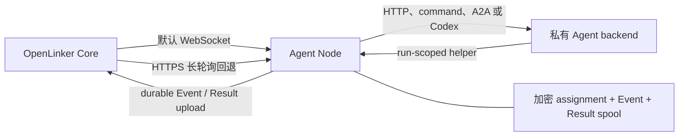

# OpenLinker Agent Node

OpenLinker Agent Node 用来运行工作站、本地网络或 NAT 后面的 Agent。Core 通过出站
HTTPS 分配任务；Agent Node 调用本地 HTTP 服务、命令、A2A Agent 或 Codex workspace，
再把 Event 和最终 Result 送回 Core。

它是被调用方运行时，不是第二套控制面。已有稳定 HTTPS endpoint 或远程 MCP endpoint
的 Agent，可以让 Core 直接调用，通常不需要 Agent Node。

English documentation: [README.md](./README.md)

## OpenLinker Runtime

Agent Node 通过两种传输承载同一条可靠运行链路。默认 `auto` 先建立低延迟 WebSocket；
如果当前网络无法建立或稳定维持连接，节点会切到 HTTPS 长轮询继续服务，并按退避节奏
探测，恢复后再切回 WebSocket。两种方式共用 session、lease、确认机制、恢复 journal、
TLS 1.3 mTLS 身份和 Agent Token。

执行链路刻意采用偏保守的设计：

1. 节点以稳定 worker ID 和新的 session epoch 建立 runtime session。WebSocket 使用
   `runtime.hello` / `runtime.ready`，长轮询使用语义一致的 HTTP Session endpoint。
2. 收到或 claim 到 offer 后，先加密并 fsync assignment，再记录 `ack_sent`，最后发送 ACK。
3. 只有收到 Core 的 lease confirmation，或恢复接口明确返回
   `continue_execution`，才会启动 adapter。
4. Event 和最终 Result 都先加密落盘再上传。重试沿用原 Event/Result ID；只有收到身份
   完全匹配的 typed ACK 才推进本地状态。已 ACK Event 会继续加密保留到 Result ACK；
   如果 Core 返回 `EVENTS_MISSING`，节点会按指定区间重传 Event，再用同一 Result ID 重试。
5. 执行期间持续续租并轮询命令。取消只作用于精确 Attempt 及其进程树；adapter 真正
   退出后才回复 `stopped`。
6. 切换 transport 时，先取消并排空旧通道上的所有调用，再 detach、用同一持久身份
   attach 新通道、按 journal 做 resume，完成后才重新开放 claim。两条通道不会并发
   领取，已经进入 `started` 的 adapter 也不会重跑。

如果进程在 adapter 已经启动后硬崩溃，Agent Node 会 fail closed：重启后上报持久化状态，
但不会擅自把进程再跑一次。Core 应撤销旧 Attempt，并按重试策略创建新 Attempt。



## 快速开始

需要准备：

- Go 1.25 或更高版本
- 已在 Core 注册的 Agent 和 Node
- 两者的小写 UUID 与 Agent Token
- Core 签发的 client certificate、private key 和受信 CA bundle
- 私有、可持久化的数据目录
- 本地 backend

构建和测试：

```bash
go test ./...
go build ./cmd/openlinker-agent-node
```

运行本地 HTTP backend：

```bash
OPENLINKER_URL=https://openlinker.example \
OPENLINKER_NODE_ID=11111111-1111-4111-8111-111111111111 \
OPENLINKER_AGENT_ID=22222222-2222-4222-8222-222222222222 \
OPENLINKER_AGENT_TOKEN=ol_agent_xxx \
OPENLINKER_AGENT_NODE_DATA_DIR=/var/lib/openlinker-agent-node \
OPENLINKER_AGENT_NODE_MTLS_CERT_FILE=/run/openlinker/node.crt \
OPENLINKER_AGENT_NODE_MTLS_KEY_FILE=/run/openlinker/node.key \
OPENLINKER_AGENT_NODE_MTLS_CA_FILE=/run/openlinker/core-ca.crt \
OPENLINKER_AGENT_NODE_TRANSPORT=auto \
OPENLINKER_AGENT_NODE_ADAPTER=http \
OPENLINKER_AGENT_NODE_HTTP_URL=http://127.0.0.1:18080/run \
go run ./cmd/openlinker-agent-node
```

数据目录有进程级独占锁。请使用持久化本地存储，把它当作敏感数据备份；不要让两个
Agent Node 进程共用同一个目录。

加密 spool 的上限是 512 MiB 和 10,000 条记录。使用量达到 80% 时，节点会把 capacity
降为 0，停止接收新 Run，但现有 Attempt 的续租、取消、上传和清理仍可继续。数据记录
不能占用逻辑上限或文件系统最后预留的 16 MiB，确保 journal 与控制流程仍有前进空间。
记录损坏、认证失败、key 丢失或容量耗尽都会 fail closed；未 ACK Result 不会因 TTL
自动删除。

## 必需的 Agent Node 配置

启动时，Agent Node 会读取
`$OPENLINKER_URL/.well-known/openlinker.json`，自动发现专用 Runtime 地址。发现请求
使用独立的 5 秒 HTTP client，不跟随跳转，最多读取 64 KiB，也不会携带 Agent Token
或 mTLS client certificate。Runtime 信息缺失、关闭、不安全或格式错误时，节点会直接
停止启动，不会退回普通 API 地址。

| 环境变量 | 用途 |
| --- | --- |
| `OPENLINKER_URL` | OpenLinker 平台地址，用于自动发现 Runtime 连接信息 |
| `OPENLINKER_NODE_ID` | 已注册 Node 的 UUID |
| `OPENLINKER_AGENT_ID` | 当前进程承载的 Agent UUID |
| `OPENLINKER_AGENT_TOKEN` | 只保留在节点内的长效 Agent Token |
| `OPENLINKER_AGENT_NODE_DATA_DIR` | 持久化身份、journal 和加密 spool |
| `OPENLINKER_AGENT_NODE_MTLS_CERT_FILE` | client certificate |
| `OPENLINKER_AGENT_NODE_MTLS_KEY_FILE` | client private key |
| `OPENLINKER_AGENT_NODE_MTLS_CA_FILE` | 用来校验 Core 的 CA bundle |
| `OPENLINKER_AGENT_NODE_MTLS_SERVER_NAME` | 可选的证书 server name 覆盖值 |
| `OPENLINKER_AGENT_NODE_TRANSPORT` | `auto`（默认）、`ws` 或 `pull`；三者共用同一 Runtime session |

`OPENLINKER_RUNTIME_URL` 是集成测试和特殊私网路由使用的高级覆盖项。它必须是绝对
HTTPS origin；设置后会跳过公开发现。普通部署无需填写。

可调参数包括 `OPENLINKER_AGENT_NODE_CAPACITY`、
`OPENLINKER_AGENT_NODE_CLAIM_WAIT_SECONDS`、
`OPENLINKER_AGENT_NODE_COMMAND_WAIT_SECONDS`、
`OPENLINKER_AGENT_NODE_HEARTBEAT_SECONDS`、
`OPENLINKER_AGENT_NODE_RETRY_MIN_MS` 和
`OPENLINKER_AGENT_NODE_RETRY_MAX_MS`。

一般部署使用 `auto`。如果运维策略要求 WebSocket 断开后原地等待，而不通过长轮询继续
服务，可以使用 `ws`；只有明确知道网络不支持 WebSocket 时才固定为 `pull`。切换时会
沿用当前 session identity、journal、加密 spool、lease 和逐 Run 的取消状态。

## Backend envelope

HTTP 和 command backend 会收到 run envelope。启用本地 helper 时，URL 和本次 run
专用的凭证位于 `agent_node` 下：

```json
{
  "input": { "query": "..." },
  "run_id": "run uuid",
  "metadata": {},
  "agent_node": {
    "helper": {
      "base_url": "http://127.0.0.1:12345",
      "token": "run-scoped helper token",
      "endpoints": {
        "call_agent": "http://127.0.0.1:12345/a2a/call",
        "events": "http://127.0.0.1:12345/events"
      }
    }
  }
}
```

长效 Agent Token 和 assignment-scoped invocation capability 都不会传给 backend。

## Adapter 模式

### `http` / `openclaw`

把 run envelope POST 到本地 HTTP 服务：

```bash
OPENLINKER_AGENT_NODE_ADAPTER=openclaw
OPENLINKER_AGENT_NODE_HTTP_URL=http://127.0.0.1:18080/run
```

### `command`

把 envelope 写入运维方指定命令的 stdin。取消任务时会终止整个命令进程树。

```bash
OPENLINKER_AGENT_NODE_ADAPTER=command
OPENLINKER_AGENT_NODE_COMMAND=/usr/local/bin/my-agent
OPENLINKER_AGENT_NODE_ARGS='["run","--json"]'
```

### `a2a`

把 run 转给 A2A JSON-RPC Agent：

```bash
OPENLINKER_AGENT_NODE_ADAPTER=a2a
OPENLINKER_AGENT_NODE_A2A_BASE_URL=http://127.0.0.1:31225/rpc
OPENLINKER_AGENT_NODE_A2A_METHOD=SendMessage
```

只有上游 Agent 仍要求 `message/send` 一类 slash-style 方法时，才设置
`OPENLINKER_AGENT_NODE_A2A_DIALECT=legacy`。

### `codex`

在隔离 workspace 中非交互运行 Codex：

```bash
OPENLINKER_AGENT_NODE_ADAPTER=codex
OPENLINKER_AGENT_NODE_CODEX_BIN=codex
OPENLINKER_AGENT_NODE_CODEX_WORKSPACE=/srv/openlinker/codex-work
OPENLINKER_AGENT_NODE_CODEX_SANDBOX=workspace-write
```

## Event 与 Agent 子调用

`http`、`openclaw`、`command` 和 `codex` 默认启用 localhost helper。command backend
还会收到以下环境变量：

```text
OPENLINKER_AGENT_NODE_HELPER_URL
OPENLINKER_AGENT_NODE_HELPER_TOKEN
OPENLINKER_AGENT_NODE_HELPER_CALL_AGENT_URL
OPENLINKER_AGENT_NODE_HELPER_EVENTS_URL
```

每次 Agent 子调用都必须提供 `idempotency_key`。重试同一个调用意图时复用同一个 key；
即使请求 body 完全相同，只要是另一个独立意图，就必须换一个 key。

```bash
curl -X POST "$OPENLINKER_AGENT_NODE_HELPER_CALL_AGENT_URL" \
  -H "Authorization: Bearer $OPENLINKER_AGENT_NODE_HELPER_TOKEN" \
  -H "Content-Type: application/json" \
  -d '{"target_agent_id":"target-agent-uuid","idempotency_key":"invoice-42-review-v1","reason":"review","input":{"invoice_id":"42"}}'
```

```bash
curl -X POST "$OPENLINKER_AGENT_NODE_HELPER_EVENTS_URL" \
  -H "Authorization: Bearer $OPENLINKER_AGENT_NODE_HELPER_TOKEN" \
  -H "Content-Type: application/json" \
  -d '{"event_type":"run.message.delta","payload":{"text":"working"}}'
```

程序化 adapter 遵循同一规则：`CallAgentOptions.IdempotencyKey` 为空时，
`RunContext.CallAgent` 会直接拒绝调用。

## 可选 Public A2A Server

Agent Node 也可以把 backend 暴露成入站 A2A server。这与 Core runtime 相互独立，默认关闭：

```bash
OPENLINKER_AGENT_NODE_PUBLIC_A2A=true
OPENLINKER_AGENT_NODE_PUBLIC_A2A_HOST=127.0.0.1
OPENLINKER_AGENT_NODE_PUBLIC_A2A_PORT=19091
OPENLINKER_AGENT_NODE_PUBLIC_A2A_SLUG=my-agent
OPENLINKER_AGENT_NODE_PUBLIC_A2A_NAME="My Agent"
OPENLINKER_PUBLIC_A2A_TOKEN=optional-bearer-token
```

该可选 server 的 Push Notification Config 只保存在内存中。需要持久化 callback
subscription 时，应使用 Core 的平台 A2A adapter。

## 安全与运维

- Agent Token、mTLS private key、spool key、assignment payload 和 helper token 都是密钥。
- 不要把 runtime 数据目录挂载进 backend container。
- command 与 Codex workspace 应隔离，并只授予必要权限。
- 优雅关闭会先上报 capacity 为 0，等待 active adapter，关闭 runtime session，再释放数据目录锁。
- 请在 spool 达到 80% 前告警并释放容量或完成上传；不要手工删除 `.record`、journal、identity 或 key 文件。
- 提 Issue 前删除凭证、私有 URL、客户 payload 和 adapter 日志。

更多说明见 [SECURITY.zh-CN.md](./SECURITY.zh-CN.md)、
[SUPPORT.zh-CN.md](./SUPPORT.zh-CN.md) 和
[CONTRIBUTING.zh-CN.md](./CONTRIBUTING.zh-CN.md)。

## 许可证

Apache-2.0。详见 [LICENSE](./LICENSE)。
