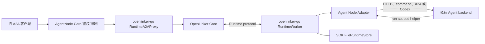

# OpenLinker Agent Node

English documentation: [README.md](./README.md)

Agent Node 用来把已经存在的 Agent 接进 OpenLinker。它运行在原有后端旁边，从 OpenLinker
Runtime 接收任务，再启动或调用后端，最后把答案传回 OpenLinker。

它可以接入：

- 本地 HTTP 服务；
- 管理员指定的命令；
- A2A JSON-RPC Agent；
- 非交互运行的 Codex 进程。

Agent Node 主要用于兼容和迁移已有后端。新写的 Go、TypeScript 或 Python Agent 如果能直接
使用 OpenLinker SDK Runtime Worker，就不需要 Agent Node。拥有稳定公网 HTTPS 地址的
Agent 和远程 MCP 服务也不需要它。

## 工作过程

1. `openlinker-go` Runtime Worker 收到任务并先安全保存。
2. Agent Node 把任务交给选定的本地后端。
3. 后端返回答案，Agent Node 再通过 SDK 交给 OpenLinker。
4. OpenLinker 取消任务时，command 和 Codex 适配器会停止自己拉起的整个进程树。

长期 Agent Token 只留在 Agent Node 内。后端需要调用其他 Agent 时，拿到的是只对当前
任务有效的本地 helper，不是长期 Token。

## 技术边界

Agent Node 不重复实现 Runtime client 或状态机。固定版本的 Go SDK 负责地址发现、mTLS、
连接身份、WebSocket/Pull 切换、任务确认、续租、恢复、取消、停止接收新任务、加密任务记录，
以及事件和结果的可靠重传。Go 应用也可以直接通过 `NewRuntimeWorker` 使用同一套能力。

本仓库负责环境变量和 CLI、适配器选择、本地 helper、进程树控制、公开 A2A
兼容监听器外壳（Card、鉴权与请求限制），以及 SDK 文件存储目录的选择。该监听器的 A2A
有状态操作由 SDK 转发给 Core；为保持外部 URL 指向 AgentNode listener，无状态 Agent Card
响应仍在本地生成。取消通过 SDK 任务上下文传入适配器；command 和 Codex 适配器
在返回前终止自己的进程树。

Agent Node 只连接 Core Runtime 契约，不调用 Hosted 的服务商品、订单、钱包、计费或市场
运营 API，也不提供 MCP 适配器。



## 状态与安装

Agent Node 目前是 pre-1.0，只用于既有 backend 的迁移接入，不是新 Agent 的默认开发方式。
升级时应同时固定 Core、Go SDK 和 Agent Node 版本，并阅读 `CHANGELOG.md`。

Linux、macOS、Windows 预构建二进制及相邻的 `.sha256` 文件发布在
[GitHub Releases](https://github.com/OpenLinker-ai/openlinker-agent-node/releases)。安装前请
校验 checksum；贡献者可以使用下方命令从源码构建。

## 快速开始

需要准备：

- Go 1.25 或更高版本
- 已在 Core 注册的 Agent 和 Node
- 两者的小写 UUID 与 Agent Token
- Core 签发的 client certificate、private key 和受信 CA bundle
- 私有、可持久化的数据目录
- 本地 backend

构建和测试：

```bash
go test ./...
go build ./cmd/openlinker-agent-node
```

登记 Runtime Node 时必须写入当前 Adapter 的精确实现版本。登记值与 Worker hello 不一致时，
Core 会拒绝 Session。`NODE_VERSION` 应填写二进制 release 报告的完整值；源码构建则原样
复制 `internal/agentnode/node.go` 中完整的 `AgentNodeVersion` 字符串：

```bash
NODE_VERSION=openlinker-agent-node/0.x.y
DATABASE_URL='postgres://...' ./api runtime-node issue \
  --ca-cert /secure/runtime-client-ca.crt \
  --ca-key /secure/runtime-client-ca.key \
  --display-name 'legacy-backend-adapter' \
  --node-version "${NODE_VERSION}" \
  --capacity 1 \
  --cert-out /run/openlinker/node.crt \
  --key-out /run/openlinker/node.key
```

运行本地 HTTP backend：

```bash
OPENLINKER_URL=https://openlinker.example \
OPENLINKER_NODE_ID=11111111-1111-4111-8111-111111111111 \
OPENLINKER_AGENT_ID=22222222-2222-4222-8222-222222222222 \
OPENLINKER_AGENT_TOKEN=ol_agent_xxx \
OPENLINKER_AGENT_NODE_DATA_DIR=/var/lib/openlinker-agent-node \
OPENLINKER_AGENT_NODE_MTLS_CERT_FILE=/run/openlinker/node.crt \
OPENLINKER_AGENT_NODE_MTLS_KEY_FILE=/run/openlinker/node.key \
OPENLINKER_AGENT_NODE_MTLS_CA_FILE=/run/openlinker/core-ca.crt \
OPENLINKER_AGENT_NODE_TRANSPORT=auto \
OPENLINKER_AGENT_NODE_ADAPTER=http \
OPENLINKER_AGENT_NODE_HTTP_URL=http://127.0.0.1:18080/run \
go run ./cmd/openlinker-agent-node
```

SDK `FileRuntimeStore` 会独占锁定数据目录。请使用持久化本地存储，把它当作敏感数据备份；不要让两个
Agent Node 进程共用同一个目录。

SDK 加密 spool 的上限是 512 MiB 和 10,000 条记录。使用量达到 80% 时，worker 会把 capacity
降为 0，停止接收新 Run，但现有 Attempt 的续租、取消、上传和清理仍可继续。数据记录
不能占用逻辑上限或文件系统最后预留的 16 MiB，确保 journal 与控制流程仍有前进空间。
记录损坏、认证失败、key 丢失或容量耗尽都会 fail closed；未 ACK Result 不会因 TTL
自动删除。

## 必需的 Agent Node 配置

启动时，Go SDK Worker 会读取
`$OPENLINKER_URL/.well-known/openlinker.json`，自动发现专用 Runtime 地址。发现请求
使用独立的 5 秒 HTTP client，不跟随跳转，最多读取 64 KiB，也不会携带 Agent Token
或 mTLS client certificate。Runtime 信息缺失、关闭、不安全或格式错误时，节点会直接
停止启动，不会退回普通 API 地址。

| 环境变量 | 用途 |
| --- | --- |
| `OPENLINKER_URL` | OpenLinker 平台地址，用于自动发现 Runtime 连接信息 |
| `OPENLINKER_NODE_ID` | 已注册 Node 的 UUID |
| `OPENLINKER_AGENT_ID` | 当前进程承载的 Agent UUID |
| `OPENLINKER_AGENT_TOKEN` | 只保留在节点内的长效 Agent Token |
| `OPENLINKER_AGENT_NODE_DATA_DIR` | 交给 SDK `FileRuntimeStore` 的目录 |
| `OPENLINKER_AGENT_NODE_MTLS_CERT_FILE` | client certificate |
| `OPENLINKER_AGENT_NODE_MTLS_KEY_FILE` | client private key |
| `OPENLINKER_AGENT_NODE_MTLS_CA_FILE` | 用来校验 Core 的 CA bundle |
| `OPENLINKER_AGENT_NODE_MTLS_SERVER_NAME` | 可选的证书 server name 覆盖值 |
| `OPENLINKER_AGENT_NODE_TRANSPORT` | `auto`（默认）、`ws` 或 `pull`；三者共用同一 Runtime session |

`OPENLINKER_RUNTIME_URL` 是集成测试和特殊私网路由使用的高级覆盖项。它必须是绝对
HTTPS origin；设置后会跳过公开发现。普通部署无需填写。

可调参数包括 `OPENLINKER_AGENT_NODE_CAPACITY`、
`OPENLINKER_AGENT_NODE_CLAIM_WAIT_SECONDS`、
`OPENLINKER_AGENT_NODE_COMMAND_WAIT_SECONDS`、
`OPENLINKER_AGENT_NODE_HEARTBEAT_SECONDS`、
`OPENLINKER_AGENT_NODE_RETRY_MIN_MS` 和
`OPENLINKER_AGENT_NODE_RETRY_MAX_MS`。

一般部署使用 `auto`。如果运维策略要求 WebSocket 断开后原地等待，而不通过长轮询继续
服务，可以使用 `ws`；只有明确知道网络不支持 WebSocket 时才固定为 `pull`。切换时会
由 SDK 实现，并沿用当前 session identity、journal、加密 spool、lease 和逐 Run 的取消状态。

## Backend envelope

HTTP 和 command backend 会收到 run envelope。启用本地 helper 时，URL 和本次 run
专用的凭证位于 `agent_node` 下：

```json
{
  "input": { "query": "..." },
  "run_id": "run uuid",
  "metadata": {},
  "agent_node": {
    "helper": {
      "base_url": "http://127.0.0.1:12345",
      "token": "run-scoped helper token",
      "endpoints": {
        "call_agent": "http://127.0.0.1:12345/a2a/call",
        "events": "http://127.0.0.1:12345/events"
      }
    }
  }
}
```

长效 Agent Token 和 assignment-scoped invocation capability 都不会传给 backend。

## Adapter 模式

### `http` / `openclaw`

把 run envelope POST 到本地 HTTP 服务：

```bash
OPENLINKER_AGENT_NODE_ADAPTER=openclaw
OPENLINKER_AGENT_NODE_HTTP_URL=http://127.0.0.1:18080/run
```

### `command`

把 envelope 写入运维方指定命令的 stdin。取消任务时会终止整个命令进程树。

```bash
OPENLINKER_AGENT_NODE_ADAPTER=command
OPENLINKER_AGENT_NODE_COMMAND=/usr/local/bin/my-agent
OPENLINKER_AGENT_NODE_ARGS='["run","--json"]'
```

### `a2a`

把 run 转给 A2A JSON-RPC Agent：

```bash
OPENLINKER_AGENT_NODE_ADAPTER=a2a
OPENLINKER_AGENT_NODE_A2A_BASE_URL=http://127.0.0.1:31225/rpc
OPENLINKER_AGENT_NODE_A2A_METHOD=SendMessage
```

只有上游 Agent 仍要求 `message/send` 一类 slash-style 方法时，才设置
`OPENLINKER_AGENT_NODE_A2A_DIALECT=legacy`。

### `codex`

在隔离 workspace 中非交互运行 Codex：

```bash
OPENLINKER_AGENT_NODE_ADAPTER=codex
OPENLINKER_AGENT_NODE_CODEX_BIN=codex
OPENLINKER_AGENT_NODE_CODEX_WORKSPACE=/srv/openlinker/codex-work
OPENLINKER_AGENT_NODE_CODEX_SANDBOX=workspace-write
```

## Event 与 Agent 子调用

`http`、`openclaw`、`command` 和 `codex` 默认启用 localhost helper。command backend
还会收到以下环境变量：

```text
OPENLINKER_AGENT_NODE_HELPER_URL
OPENLINKER_AGENT_NODE_HELPER_TOKEN
OPENLINKER_AGENT_NODE_HELPER_CALL_AGENT_URL
OPENLINKER_AGENT_NODE_HELPER_EVENTS_URL
```

每次 Agent 子调用都必须提供 `idempotency_key`。重试同一个调用意图时复用同一个 key；
即使请求 body 完全相同，只要是另一个独立意图，就必须换一个 key。

```bash
curl -X POST "$OPENLINKER_AGENT_NODE_HELPER_CALL_AGENT_URL" \
  -H "Authorization: Bearer $OPENLINKER_AGENT_NODE_HELPER_TOKEN" \
  -H "Content-Type: application/json" \
  -d '{"target_agent_id":"target-agent-uuid","idempotency_key":"invoice-42-review-v1","reason":"review","input":{"invoice_id":"42"}}'
```

```bash
curl -X POST "$OPENLINKER_AGENT_NODE_HELPER_EVENTS_URL" \
  -H "Authorization: Bearer $OPENLINKER_AGENT_NODE_HELPER_TOKEN" \
  -H "Content-Type: application/json" \
  -d '{"event_type":"run.message.delta","payload":{"text":"working"}}'
```

程序化 adapter 遵循同一规则：`CallAgentOptions.IdempotencyKey` 为空时，
`RunContext.CallAgent` 会直接拒绝调用。

## 可选 Public A2A 兼容监听器

Agent Node 可以提供一个兼容旧接入方式的本地 A2A 地址。监听器只负责展示本地
Agent Card 并校验 `OPENLINKER_PUBLIC_A2A_TOKEN`；所有 message、task、push、
有状态 JSON-RPC 与 SSE 请求都由 Go SDK 通过 Agent Token 和 mTLS 身份转发到 Core。
REST 和 JSON-RPC Agent Card 响应仍在本地生成，以保持外部 URL 指向此监听器。
A2A task、run、stream 与 push 状态的唯一权威仍是 Core。该监听器默认关闭：

```bash
OPENLINKER_AGENT_NODE_PUBLIC_A2A=true
OPENLINKER_AGENT_NODE_PUBLIC_A2A_HOST=127.0.0.1
OPENLINKER_AGENT_NODE_PUBLIC_A2A_PORT=19091
OPENLINKER_AGENT_NODE_PUBLIC_A2A_SLUG=my-agent
OPENLINKER_AGENT_NODE_PUBLIC_A2A_NAME="My Agent"
OPENLINKER_PUBLIC_A2A_TOKEN=optional-bearer-token
```

兼容监听器将每个请求体限制为 1 MiB，并对 header/body 读取设置超时；SSE 响应不设置
监听器级写入截止时间，其生命周期由客户端取消和 Core stream 决定。

## 安全与运维

- Agent Token、mTLS private key、SDK 管理的 spool key、assignment payload 和 helper token 都是密钥。
- 不要把 runtime 数据目录挂载进 backend container。
- command 与 Codex workspace 应隔离，并只授予必要权限。
- 优雅关闭会先上报 capacity 为 0，等待 active adapter，关闭 runtime session，再释放数据目录锁。
- 请在 SDK spool 达到 80% 前告警并释放容量或完成上传；不要手工删除 `.record`、journal、identity 或 key 文件。
- 提 Issue 前删除凭证、私有 URL、客户 payload 和 adapter 日志。

更多说明见 [SECURITY.zh-CN.md](./SECURITY.zh-CN.md)、
[SUPPORT.zh-CN.md](./SUPPORT.zh-CN.md) 和
[CONTRIBUTING.zh-CN.md](./CONTRIBUTING.zh-CN.md)。

## 许可证

Apache-2.0。详见 [LICENSE](./LICENSE)。
