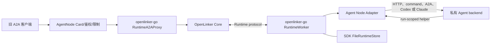

# OpenLinker Agent Node

English documentation: [README.md](./README.md)

Agent Node 用来把已经存在的 Agent 接进 OpenLinker。它运行在原有后端旁边，从 OpenLinker
Runtime 接收任务，再启动或调用后端，最后把答案传回 OpenLinker。

它可以接入：

- 本地 HTTP 服务；
- 管理员指定的命令；
- A2A JSON-RPC Agent；
- 非交互运行的 Codex / Claude Code 进程，使用本仓库的原生桥接适配器。

Agent Node 是可独立部署的已有后端桥接器，不是所有 Agent 的必经中转。新写的 Go、TypeScript 或 Python Agent 如果能直接
使用 OpenLinker SDK Runtime Worker，就不需要 Agent Node。拥有稳定公网 HTTPS 地址的
Agent 和远程 MCP 服务也不需要它。

## 工作过程

1. `openlinker-go` Runtime Worker 收到任务并先安全保存。
2. Agent Node 把任务交给选定的本地后端。
3. 后端返回答案，Agent Node 再通过 SDK 交给 OpenLinker。
4. OpenLinker 取消任务时，command 和原生 Provider 适配器会停止自己拉起的整个进程树。

长期 Agent Token 只留在 Agent Node 内。后端需要调用其他 Agent 时，拿到的是只对当前
任务有效的本地 helper（HTTP / command），或 Attempt 范围内的 MCP 委派工具（原生 Codex / Claude）。

## 技术边界

Agent Node 不重复实现 Runtime client 或状态机。固定版本的 Go SDK 负责地址和 token-only/mTLS 安全策略发现、
连接身份、WebSocket/Pull 切换、任务确认、续租、恢复、取消、停止接收新任务、加密任务记录，
以及事件和结果的可靠重传。Go 应用也可以直接通过 `NewRuntimeWorker` 使用同一套能力。

本仓库负责环境变量和 CLI、适配器选择、本地 helper、进程树控制、公开 A2A
兼容监听器外壳（Card、鉴权与请求限制），以及 SDK 文件存储目录的选择。该监听器的 A2A
有状态操作由 SDK 转发给 Core；为保持外部 URL 指向 AgentNode listener，无状态 Agent Card
响应仍在本地生成。取消通过 SDK 任务上下文传入适配器；command 和原生 Provider 适配器
在返回前终止自己的进程树。

本仓库还维护 `pkg/adapters` 公开协议叶子，Plugin 可编译期复用，不要求另启 Node
进程。Node 的模块图与包图均不依赖 CLI/Plugin；Plugin 仍保留独立深度执行策略及
Browser/Viewer/Profile 产品能力。

Agent Node 只连接 Core Runtime 契约，不调用 Hosted 的服务商品、订单、钱包、计费或市场
运营 API，也不提供 MCP 适配器。


```mermaid
flowchart LR
  Core["OpenLinker Core"] <-->|"Runtime protocol"| SDK["openlinker-go RuntimeWorker"]
  SDK --> Handler["Agent Node Adapter"]
  Handler -->|"HTTP、command、A2A、Codex 或 Claude"| Backend["私有 Agent backend"]
  Backend -->|"run-scoped helper"| Handler
  SDK --- Store["SDK FileRuntimeStore"]
  A2AClient["旧 A2A 客户端"] --> Compat["AgentNode Card/鉴权/限制"]
  Compat --> Proxy["openlinker-go RuntimeA2AProxy"]
  Proxy --> Core
```

## 状态与安装

Agent Node 目前是 pre-1.0，用于既有 backend 的桥接接入，不是新 Agent 的默认开发方式。
升级时应同时固定 Core、Go SDK 和 Agent Node 版本，并阅读 `CHANGELOG.md`。

Linux、macOS、Windows 预构建二进制及相邻的 `.sha256` 文件发布在
[GitHub Releases](https://github.com/OpenLinker-ai/openlinker-agent-node/releases)。安装前请
校验 checksum；贡献者可以使用下方命令从源码构建。

### 候选构建身份与仅限测试的重新登记

本源码候选新增 `openlinker-agent-node --version`，在读取配置、启动 Provider/监听器、
打开 SDK 状态或发出网络请求之前，输出与 Runtime 登记相同的实现身份。不带参数仍启动
配置的 Worker；未知参数不启动服务并报错。原生委派一节列出的内部 agent-host v1 命令
同样不会启动 Worker。旧发布物未必包含这些入口，须检查实际选用的二进制。

源码构建报告 `openlinker-agent-node/dev`，打包构建注入精确 `v...` tag 或 `sha-...`。
统一构建入口为 `node scripts/build-agent-node.mjs <version> <output>`，需要 Node.js 22
与 Go；运行已下载二进制不需要这些构建工具。

**本候选仅允许 pre-1.0 测试预发布，不支持已经登记的 Node 原地升级。** 发布门禁只
接受规范的 `v0.x.y-alpha.N`、`v0.x.y-beta.N` 或 `v0.x.y-rc.N` tag，数字均为无前导零的
非负整数；稳定版、v1+、缺参和格式错误均拒绝，没有环境变量旁路。非 tag 的 SHA 产物
仍可用于 CI 测试，但不创建 GitHub Release。

对于没有真实用户的测试部署，变更版本采用显式重新登记：

1. 停止新增测试调用，确认旧 Attempt 全部结算且 SDK spool 为空，再停止旧测试进程。
   保留旧私有数据目录；不得清空状态，不得让两个 Worker 共用一个目录。
2. 通过 Core 现有登记/Token 流程取得新的、未绑定且有效的 Agent 凭据，使用新的
   `OPENLINKER_NODE_ID` 和私有 `OPENLINKER_AGENT_NODE_DATA_DIR`；不得复用旧绑定、
   identity、证书或私钥。发现清单仍决定 token-only 或 mTLS 登记方式。
3. 启动选定的精确二进制，核验 `--version`、新 Node ready 以及一次任务执行。这里
   有意改变 Node 身份，不是旧登记的升级，也不提供自动回滚。

**active** Node 的普通重启保留相同精确二进制版本、Node 身份、凭据和 SDK DataDir，
由 SDK 轮换 Runtime Session；不要每次重启都新建目录。该行为不涵盖已撤销或被行政
drain 的 Node。原登记直接替换成不同版本不受支持，可能返回 `ContractMismatch`，
不得伪报旧版本绕过。新的测试登记不依赖 Core 受控升级扩展或通用迁移控制器。

上述是源码兼容性与发布策略边界，不代表本候选已经发布、部署。宣称目标环境通过前，
仍须记录真实 WebSocket 和 pull 的登记、任务执行及同 DataDir 重启测试结果。
详见 [RELEASE.zh-CN.md](./RELEASE.zh-CN.md)。

## 快速开始

需要准备：

- Go 1.26.4 或更高版本
- 有效的 Agent Token
- 私有、可持久化的数据目录
- 本地 backend

构建和测试：

```bash
go test ./...
go build ./cmd/openlinker-agent-node
```

平台发现决定 Runtime 使用 token-only 还是 mTLS。mTLS 策略下，SDK 可在私有目录生成私钥，
并自动登记和续期短期客户端证书。

运行本地 HTTP backend：

```bash
OPENLINKER_URL=https://openlinker.example \
OPENLINKER_AGENT_ID=22222222-2222-4222-8222-222222222222 \
OPENLINKER_AGENT_TOKEN=ol_agent_xxx \
OPENLINKER_AGENT_NODE_DATA_DIR=/var/lib/openlinker-agent-node \
OPENLINKER_AGENT_NODE_TRANSPORT=auto \
OPENLINKER_AGENT_NODE_ADAPTER=http \
OPENLINKER_AGENT_NODE_HTTP_URL=http://127.0.0.1:18080/run \
go run ./cmd/openlinker-agent-node
```

SDK `FileRuntimeStore` 会独占锁定数据目录。请使用持久化本地存储，把它当作敏感数据备份；不要让两个
Agent Node 进程共用同一个目录。

SDK 加密 spool 的上限是 512 MiB 和 10,000 条记录。使用量达到 80% 时，worker 会把 capacity
降为 0，停止接收新 Run，但现有 Attempt 的续租、取消、上传和清理仍可继续。数据记录
不能占用逻辑上限或文件系统最后预留的 16 MiB，确保 journal 与控制流程仍有前进空间。
记录损坏、认证失败、key 丢失或容量耗尽都会 fail closed；未 ACK Result 不会因 TTL
自动删除。

## 必需的 Agent Node 配置

启动时，Go SDK Worker 会读取
`$OPENLINKER_URL/.well-known/openlinker.json`，自动发现专用 Runtime 地址。发现请求
使用独立的 5 秒 HTTP client，不跟随跳转，最多读取 64 KiB，也不会携带 Agent Token
或 client certificate；同一份清单决定 token-only/mTLS 策略。Runtime 信息缺失、关闭、不安全或格式错误时，节点会直接
停止启动，不会退回普通 API 地址。

| 环境变量 | 用途 |
| --- | --- |
| `OPENLINKER_URL` | OpenLinker 平台地址，用于自动发现 Runtime 连接信息 |
| `OPENLINKER_NODE_ID` | 可选的已有 Runtime Node UUID；token-only 发现模式省略时会派生稳定、仅限该凭证的值 |
| `OPENLINKER_AGENT_ID` | Agent UUID；token-only Runtime 必填 |
| `OPENLINKER_AGENT_TOKEN` | 只保留在节点内的长效 Agent Token |
| `OPENLINKER_AGENT_NODE_DATA_DIR` | 交给 SDK `FileRuntimeStore` 的目录 |
| `OPENLINKER_AGENT_NODE_MTLS_CERT_FILE` | 仅发现要求 mTLS 时可选的外部 PKI 证书 |
| `OPENLINKER_AGENT_NODE_MTLS_KEY_FILE` | 可选外部 PKI 私钥，必须完整配置 cert/key/CA 组 |
| `OPENLINKER_AGENT_NODE_MTLS_CA_FILE` | 可选的外部 PKI 兼容 CA bundle |
| `OPENLINKER_AGENT_NODE_MTLS_SERVER_NAME` | 可选的证书 server name 覆盖值 |
| `OPENLINKER_AGENT_NODE_TRANSPORT` | `auto`（默认）、`ws` 或 `pull`；三者共用同一 Runtime session |

`OPENLINKER_RUNTIME_URL` 是集成测试和特殊私网路由使用的高级连接地址覆盖项。平台发现
仍会执行并决定安全策略，覆盖值不能把 mTLS 清单降级为 token-only。普通部署无需填写。
没有 `OPENLINKER_URL` 的旧式 Runtime URL 直连仍要求完整 mTLS 配置。

可调参数包括 `OPENLINKER_AGENT_NODE_CAPACITY`、
`OPENLINKER_AGENT_NODE_CLAIM_WAIT_SECONDS`、
`OPENLINKER_AGENT_NODE_COMMAND_WAIT_SECONDS`、
`OPENLINKER_AGENT_NODE_HEARTBEAT_SECONDS`、
`OPENLINKER_AGENT_NODE_RETRY_MIN_MS` 和
`OPENLINKER_AGENT_NODE_RETRY_MAX_MS`。

一般部署使用 `auto`。如果运维策略要求 WebSocket 断开后原地等待，而不通过长轮询继续
服务，可以使用 `ws`；只有明确知道网络不支持 WebSocket 时才固定为 `pull`。切换时会
由 SDK 实现，并沿用当前 session identity、journal、加密 spool、lease 和逐 Run 的取消状态。

## Backend envelope

HTTP 和 command backend 会收到 run envelope。启用本地 helper 时，URL 和本次 run
专用的凭证位于 `agent_node` 下：

```json
{
  "input": { "query": "..." },
  "run_id": "run uuid",
  "metadata": {},
  "agent_node": {
    "helper": {
      "base_url": "http://127.0.0.1:12345",
      "token": "run-scoped helper token",
      "endpoints": {
        "call_agent": "http://127.0.0.1:12345/a2a/call",
        "events": "http://127.0.0.1:12345/events"
      }
    }
  }
}
```

长效 Agent Token 和 assignment-scoped invocation capability 都不会传给 backend。

## Adapter 模式

### `http` / `openclaw`

把 run envelope POST 到本地 HTTP 服务：

```bash
OPENLINKER_AGENT_NODE_ADAPTER=openclaw
OPENLINKER_AGENT_NODE_HTTP_URL=http://127.0.0.1:18080/run
```

### `command`

把 envelope 写入运维方指定命令的 stdin。取消任务时会终止整个命令进程树。

```bash
OPENLINKER_AGENT_NODE_ADAPTER=command
OPENLINKER_AGENT_NODE_COMMAND=/usr/local/bin/my-agent
OPENLINKER_AGENT_NODE_ARGS='["run","--json"]'
```

### `a2a`

把 run 转给 A2A JSON-RPC Agent：

```bash
OPENLINKER_AGENT_NODE_ADAPTER=a2a
OPENLINKER_AGENT_NODE_A2A_BASE_URL=http://127.0.0.1:31225/rpc
OPENLINKER_AGENT_NODE_A2A_METHOD=SendMessage
```

只有上游 Agent 仍要求 `message/send` 一类 slash-style 方法时，才设置
`OPENLINKER_AGENT_NODE_A2A_DIALECT=legacy`。

### `codex`

在隔离 workspace 中非交互运行 Codex：

```bash
OPENLINKER_AGENT_NODE_ADAPTER=codex
OPENLINKER_AGENT_NODE_CODEX_BIN=codex
OPENLINKER_AGENT_NODE_CODEX_WORKSPACE=/srv/openlinker/codex-work
OPENLINKER_AGENT_NODE_CODEX_SANDBOX=workspace-write
```

### `claude`

```bash
OPENLINKER_AGENT_NODE_ADAPTER=claude
OPENLINKER_AGENT_NODE_CLAUDE_BIN=claude
OPENLINKER_AGENT_NODE_CLAUDE_WORKSPACE=/srv/openlinker/claude-work
OPENLINKER_AGENT_NODE_CLAUDE_PERMISSION=dontAsk
OPENLINKER_AGENT_NODE_CLAUDE_WEB_SEARCH=false
```

`OPENLINKER_AGENT_NODE_CLAUDE_WEB_SEARCH` 默认 **false**，桥接器传入
`--disallowedTools WebSearch,WebFetch`。显式 true 只取消桥接层对这两个内置网页工具的
禁止，不改变 `dontAsk`、`--safe-mode`、允许工具列表、管理策略、Browser 或委派。
工具可用不等于自动批准或联网必然成功；需要的 `OPENLINKER_AGENT_NODE_CLAUDE_ALLOWED_TOOLS` 仍须单独审核。
此开关不是 OS 沙箱或通用网络封禁。

取值忽略大小写与两端空白，接受 true/false、1/0、yes/no、on/off；空值为 false。
其他值在启动前报配置错误，不回显原值。配置在 Node 生命周期内固定，不支持热更新。
`v0.1.57-rc.1` 二进制尚未读取此开关，单设环境变量不能修复旧版本。应使用包含本修复
的发布物，并遵循上方版本变更的新身份登记流程，不得将新代码伪标成 rc.1。

两端均使用本仓库的 `pkg/adapters`，共同协议解析、私有会话存储和进程机制在公开叶子包内。
SDK 固定为 `v0.2.0-rc8.0.20260908135527-31afbf9c1a18`。
启动前检查原生 CLI 版本及所需参数，当前验证基线是 Codex 0.153.0、Claude 2.1.259。
Codex app-server 的完整轮次流程通过公开叶子
[`codexturn`](pkg/adapters/codexturn/README.md) 共享；Node/Plugin 各自保留启动、工具和
会话策略，共用取消与进程退出逻辑。
Codex 从有界 JSONL 读取最终答复，Claude 持续发送标准化进度。
`OPENLINKER_AGENT_NODE_CODEX_SESSION_REUSE` / `CLAUDE_SESSION_REUSE`（同前缀）及
各自的 `*_SESSION_STORE` 配置会话复用，恢复时补入 Core 历史增量。
旧 Node Codex 会话映射不自动导入，首次运行由 Core 历史建立新会话；输出不再包含明文
session key，模型 prompt 不再携带 localhost helper 凭证。

原生会话复用默认 **false**；保持已有工作流时必须显式启用，并保持 workspace 与
session-store 路径稳定。显式 true 的验证不能代替默认配置验证；同一 OS 身份下分开
目录也不等于隔离本机数据或其他会话。

Claude 成功结果增加两个长期、可选的诊断字段：

- `claude_resume_session_id_sha256`：最终成功调用实际传给 `--resume` 的非空 ID 哈希；
  该次调用未 resume 则省略。
- `claude_session_id_sha256`：Claude 成功返回的非空 `result.session_id` 哈希；缺失则
  省略，绝不以请求 ID 补填。

两者都是原 ID UTF-8 的小写十六进制 SHA256，不作为凭据、授权或会话选择依据。
missing-session 回退清除失败调用的证据，重新建立会话不算 resume 成功；字段缺失
不能视为两会话相同。哈希仍可关联，沿用 Run 结果的访问/保留规则，不新增原始 session ID。
既有 `claude_session_reuse` 只在启用复用且存在可信 session key 时输出。

原生委派使用 `OPENLINKER_AGENT_NODE_DELEGATION_TARGETS`（允许的 Agent UUID 的 JSON 数组）。
默认以当前运行的 `openlinker-agent-node` 自身作为委派宿主，无需安装 OpenLinker CLI 或 Plugin。
`OPENLINKER_AGENT_NODE_DELEGATION_PROXY_BIN` 仅用于显式覆盖宿主，选中的程序必须实现冻结的
`openlinker.agent-host.v1` 协议。Node 实现 `plugin capabilities` 和
`plugin delegation-proxy --host codex|claude`；这里的 `plugin` 是 v1 协议命令名，不是
Plugin 依赖。Node 只声明 `delegation_proxy`，拒绝 Browser 命令。这两个子进程入口不读取
Node 服务配置，也不启动 Worker。可用以下命令检查实际安装的二进制；旧发布物未必有此入口：

```bash
openlinker-agent-node plugin capabilities
# {"protocol":"openlinker.agent-host.v1","browser_proxy":false,"delegation_proxy":true}
```

可选 `OPENLINKER_AGENT_NODE_DELEGATION_BROKER_ROOT`
指定私有 socket 目录。默认关闭委派，启用需要 SDK / Core 的 `delegated_run_read.v1` 扩展。
Claude 工具列表为 `OPENLINKER_AGENT_NODE_CLAUDE_ALLOWED_TOOLS`（JSON 字符串数组）；
两端超时都使用 `OPENLINKER_AGENT_NODE_TIMEOUT_MS`。原生 Provider 接收受限 MCP 工具。

**Claude 委派使用 `--bare`，不读取 OAuth/钥匙串登录。** Node 在探测 Claude、启动 SDK
Worker 之前要求 `ANTHROPIC_API_KEY` 或 `ANTHROPIC_API_KEY_FILE`。文件必须由 Node 用户
持有、非空、不超过 64 KiB，且为其他用户不可访问的普通文件（例如权限 `0600`），不能是
符号链接。文件来源仅支持 POSIX；Windows 未实现 DACL 校验，须使用直接 key。
两种来源不能同时配置。Node 只解析一次，将值传给 Claude，不向 Provider 传递
文件路径；委派代理启动时清除继承的 API key 和平台 token，仅经私有 socket 转发 MCP。
轮换 key 后须重启 Node。该检查验证本地配置，不验证
远端 key 是否有效。未开委派的普通 Claude 保留原生认证方式，也可显式使用文件来源。
Codex 委派不要求 Claude API key。

## Event 与 Agent 子调用

`http`、`openclaw` 和 `command` 默认启用 localhost helper。command backend
还会收到以下环境变量：

```text
OPENLINKER_AGENT_NODE_HELPER_URL
OPENLINKER_AGENT_NODE_HELPER_TOKEN
OPENLINKER_AGENT_NODE_HELPER_CALL_AGENT_URL
OPENLINKER_AGENT_NODE_HELPER_EVENTS_URL
```

每次 Agent 子调用都必须提供 `idempotency_key`。重试同一个调用意图时复用同一个 key；
即使请求 body 完全相同，只要是另一个独立意图，就必须换一个 key。

```bash
curl -X POST "$OPENLINKER_AGENT_NODE_HELPER_CALL_AGENT_URL" \
  -H "Authorization: Bearer $OPENLINKER_AGENT_NODE_HELPER_TOKEN" \
  -H "Content-Type: application/json" \
  -d '{"target_agent_id":"target-agent-uuid","idempotency_key":"invoice-42-review-v1","reason":"review","input":{"invoice_id":"42"}}'
```

```bash
curl -X POST "$OPENLINKER_AGENT_NODE_HELPER_EVENTS_URL" \
  -H "Authorization: Bearer $OPENLINKER_AGENT_NODE_HELPER_TOKEN" \
  -H "Content-Type: application/json" \
  -d '{"event_type":"run.message.delta","payload":{"text":"working"}}'
```

程序化 adapter 遵循同一规则：`CallAgentOptions.IdempotencyKey` 为空时，
`RunContext.CallAgent` 会直接拒绝调用。

## 可选 Public A2A 兼容监听器

Agent Node 可以提供一个兼容旧接入方式的本地 A2A 地址。监听器只负责展示本地
Agent Card 并校验 `OPENLINKER_PUBLIC_A2A_TOKEN`；所有 message、task、push、
有状态 JSON-RPC 与 SSE 请求都由 Go SDK 通过 Agent Token 和发现得到的安全策略转发到 Core。
REST 和 JSON-RPC Agent Card 响应仍在本地生成，以保持外部 URL 指向此监听器。
A2A task、run、stream 与 push 状态的唯一权威仍是 Core。该监听器默认关闭：

```bash
OPENLINKER_AGENT_NODE_PUBLIC_A2A=true
OPENLINKER_AGENT_NODE_PUBLIC_A2A_HOST=127.0.0.1
OPENLINKER_AGENT_NODE_PUBLIC_A2A_PORT=19091
OPENLINKER_AGENT_NODE_PUBLIC_A2A_SLUG=my-agent
OPENLINKER_AGENT_NODE_PUBLIC_A2A_NAME="My Agent"
OPENLINKER_PUBLIC_A2A_TOKEN=optional-bearer-token
```

兼容监听器将每个请求体限制为 1 MiB，并对 header/body 读取设置超时；SSE 响应不设置
监听器级写入截止时间，其生命周期由客户端取消和 Core stream 决定。

## 安全与运维

- Agent Token、可能存在的 mTLS private key、SDK 管理的 spool key、assignment payload 和 helper token 都是密钥。
- 不要把 runtime 数据目录挂载进 backend container。
- command 与 Codex workspace 应隔离，并只授予必要权限。
- Stop 不等于已确认 drain；运维切换前须围栏接单、核实 Core 结算及 SDK spool 为空。
  停进程可能取消正在执行的 adapter，关闭失败须保留状态。
- 请在 SDK spool 达到 80% 前告警并释放容量或完成上传；不要手工删除 `.record`、journal、identity 或 key 文件。
- 提 Issue 前删除凭证、私有 URL、客户 payload 和 adapter 日志。

更多说明见 [SECURITY.zh-CN.md](./SECURITY.zh-CN.md)、
[SUPPORT.zh-CN.md](./SUPPORT.zh-CN.md) 和
[CONTRIBUTING.zh-CN.md](./CONTRIBUTING.zh-CN.md)。

## 许可证

Apache-2.0。详见 [LICENSE](./LICENSE)。

## 共享文件机制与 Handler 兼容

`pkg/adapters/appfiles` 负责严格 JSON 解码、私有文件与凭据读取、原子替换和跨进程 app 锁。
Node 的 helper 请求解码及原生凭据文件读取使用该叶子；Plugin 可编译期复用，无需 Node 进程。
产品默认值、持久路径与锁生命周期仍由调用方维护。

已发布的 `adapters.NewHandler` / `adapters.Handler` 保留在 `handler_compat.go` 并增加兼容回归。
该 API 标记为弃用，新接入使用 `NewProvider` 并在宿主组装 SDK Handler；Node 本身使用 `NativeAdapter`。

## 不依赖 Docker 的会话隔离

macOS/Linux 上可显式设置 `OPENLINKER_AGENT_NODE_SESSION_ISOLATION=native`。
Codex／Claude 整个客户端及子工具在系统沙箱内运行，各会话独享持久工作区和原生历史，
会话映射、锁和策略位于客户端不可读的控制目录。缺少沙箱能力时启动失败，不降级；
未开启时默认行为不变。需要专用 API key、明确的运行库读取路径和联网域名，不导入个人
OAuth／钥匙串登录或旧会话。开启前请阅读[完整配置与边界](docs/native-session-isolation.zh-CN.md)。
这不等于 CPU／磁盘配额或容器级孤儿进程回收；当前是源码实现，不代表安装版本或运行中
Agent 已升级。Plugin 的产品入口不会自动启用本策略。
